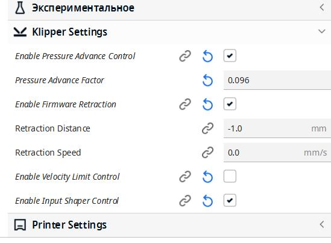

 [**Настройка Klipper для 3D-принтера FlyingBear Ghost 6 с подключением по USB**](https://github.com/flyingbear-reborn2/wiki/blob/main/FBG6/klipper.md) 
 мануал  для совсем новичков, написан при моем содействии.
 
[**Klippersreen**](klippersreen/readme.md) 

Если не запустился сразу покупной экран.

[**Что Купить**](what_2_buy/readme.md) всё что надо для того, чтобы принтер  вас любил.
 
 [**klipper_config**](https://github.com/Tombraider2006/klipperFB6/tree/main/klipper_config)
 
 в папке конфиг клиппера на flying bear ghost 6 
  подходит для стокового принтера без доработок, также есть закомментированные разделы небольших доработок. в комментариях файла config.cfg  есть какие то пояснения. читайте внимательно.
*не нужно бездумно копировать всю папку, вам нужен только [конфиг](klipper_config/printer.cfg) остальные файлы просто для сравнения со своими когда вам это будет нужно.*

[**adxl345_2_mcu**](https://github.com/Tombraider2006/klipperFB6/tree/main/adxl345_2_mcu)

 в папке adxl345_2_mcu описан способ подключения акселерометра к плате принтера.
 
 [**drivers_uart**](https://github.com/Tombraider2006/klipperFB6/tree/main/drivers_uart)

  в папке drivers_uart краткий мануал по распайке драйверов по юарт для платы MKS Robin Nano v4 3.1
  
  [**mcu_uart**](https://github.com/Tombraider2006/klipperFB6/tree/main/mcu_uart)

 наглядно о подключении orange pi 3 lts к плате принтера по uart(чтоб провода наружу не торчали)
 
  [**bme280**](https://github.com/Tombraider2006/klipperFB6/tree/main/bme280)

  Подключение датчика температуры BME280
  
   [**clean_nozle**](https://github.com/Tombraider2006/klipperFB6/tree/main/clean_nozle)

  монтаж щетки очистки сопла, модель, макрос.
  
[**placement**](https://github.com/Tombraider2006/klipperFB6/tree/main/placement)

  В этой папке вариант размещения оборудования внутри принтера. там же необходимые модели для этого.
 
[**led_rgb**](https://github.com/Tombraider2006/klipperFB6/tree/main/led_rgb)

Подключение адресной светодиодной ленты к плате принтера

[**biqu_h2**](karas/readme.md)
Модель каретки под экструдер biqu_h2 для FlyingBear Ghost 6

 *<h2>остальное</h2>*

 [**ustreamer**](https://fb-waiters.bibirevo.net/klipper/ustreamer#zachem_i_pochemu) 

 Замена\Установка стримингового модуля. Так как mjpg-streamer умер на данный момент, а камеру хочется, читаем, ставим. если что то непонятно есть альтернативный источник [тут](https://fdmprint.ru/2022/11/10/klipper_ustreamer/)

**timelapse здорового человека** 

многие пользуются функцией таймлапсов которые предоставляет телеграм бот но он ограничен в функионале и не позволяет делать красиво.
если хотите получить действительно хорошие видео рекомендую [вот этот плагин](https://github.com/mainsail-crew/moonraker-timelapse) есть отвод головы на время сьемки кадра, переменный целевой fps и многое другое. посмотрите страничку авторов на гитхабе - не пожалеете. 

[**timelapse matrix stail**](matrix_timelapse/readme.md)

Новейший проект от меня, только тут и нигде больше)

**клипперскрин** подключение штатного экрана по [этому мануалу](https://sergey1560.github.io/fb4s_howto/mks_ts35/) в родном мануале совсем невнятная схема подключения [тут](TS35%20Klipper.pdf) тоже самое но чуть понятнее.

**клипперскрин** если у вас raspberry [тут](https://github.com/willngton/3DPrinterConfig/blob/main/mks_ts35/mks_ts35_guide_archived.md) или [тут](https://github.com/evgs/FBG6-Klipper/blob/main/Klipperscreen-RPI.md)

**глюки spi** при подключении акселерометра можно устранить по [этому мануалу](https://github.com/orangepi-xunlong/wiringOP) (обычно глюк в 24 не работающем пине исправляется установкой этого git и командой  sudo gpio mode 15 ALT2  

Добавил схему подключения акселерометра непосредственно к плате принтера смотри раздел [adxl_2_mcu](adxl345_2_mcu/readme.md)

[**Автоперезапуск сервиса klipper после включения принтера**](https://mirv.top/2021/10/08/avtoperezapusk-servisa-klipper-posle-vklyucheniya-printera/)

[**Flyingbear.info**](https://flyingbear.info/firmware/klipper/klipper_config)- полезный ресурс от 5 мишки, там про то как настроить например вебкамеру и не только. многое подойдет на 6 мишку если не забывать что у нас разные платы)

 [**распиновка платы**](https://github.com/makerbase-mks/MKS-Robin-Nano-V3.X/tree/main/hardware/MKS%20Robin%20Nano%20V3.1_001) - да она под сьемные драйвера в остальном сопадает с мишко6. использрвать когда надо узнать какой пин в клиппере написать.

 [**хорошее wiki по клипперу**](https://klipper.wiki/ru/home/initial/peripheral)
 
  когда мне лень писать и я пишу что посмотрите сами, лезьте на этот ресурс вероятнее найдете подробную инструкцию

 [**wiki по телеграм боту**](https://github.com/nlef/moonraker-telegram-bot/wiki). там же как установить.

 [**телеграм чат FB6 владельцев и Reborn2**](https://t.me/fbg5_waiters) где есть многое, если не всё для владельца flying bear ghost 6  он же просто мишка 6. 

[**Плагин для слайсера CURA с настройками klipper**](https://github.com/jjgraphix/KlipperSettingsPlugin)

`Ставьте звездочку проекту, так будет проще находить владельцам принтера нужную информацию`

[Если вы считаете мой проект хорошим вы можете помочь денежкой тут.деньги поступят на карту дочери](https://pay.cloudtips.ru/p/f84bf0b2)
 