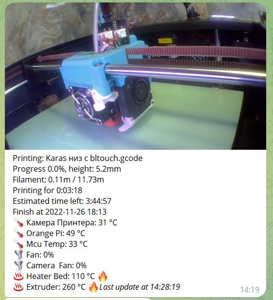

<h3 align="right"><a href="https://pay.cloudtips.ru/p/f84bf0b2" target="_blank">ваше "спасибо" автору</a></h3>

[**Мануал для тех кто только получил принтер**](/tune-up/newby.md)

[**Что Купить**](what_2_buy/readme.md) всё что надо для того, чтобы принтер  вас любил.

 [**Мануалы по настройке**](tune-up/readme.md) если возник вопрос "как  настроить"  вам сюда. *(фаза активного наполнения.)*

*<h2>**Модификации**</h2>*

1. [**Marlin 2.1**](marlin/readme.md) модифицированные прошивки марлин, чтоб было на что откатиться, если не понравился klipper.

1.  [**drivers_uart**](https://github.com/Tombraider2006/klipperFB6/tree/main/drivers_uart)
    мануал по распайке драйверов по юарт для платы MKS Robin Nano v4 3.1. избавляемся от ора моторов на высоких скоростях  
2.  [**mcu_uart**](https://github.com/Tombraider2006/klipperFB6/tree/main/mcu_uart)   наглядно о подключении orange pi 3 lts к плате принтера по uart(чтоб провода наружу не торчали)
3.  [**Управление питанием системы, содержащей одноплатный компьютер Orange Pi3 LTS**](https://github.com/evgs/OrangePi3Lts/tree/main/power) 
 
4.  [**bme280**](https://github.com/Tombraider2006/klipperFB6/tree/main/bme280)
     Подключение датчика температуры BME280

5. [**подключение i2c датчиков к плате принтера**](i2c_mcu/readme.md) bme280, lm75a, ht21d и другие.
  
6.   [**clean_nozle**](https://github.com/Tombraider2006/klipperFB6/tree/main/clean_nozle)
     монтаж щетки очистки сопла, модель, макрос.
  
7. [**placement**](https://github.com/Tombraider2006/klipperFB6/tree/main/placement)
   Вариант размещения оборудования внутри принтера. там же необходимые модели для этого.
 
8. [**led_rgb**](https://github.com/Tombraider2006/klipperFB6/tree/main/led_rgb)   Подключение адресной светодиодной ленты к плате принтера

  1. [**Расширение памяти на Orange Pi 3 LTS (и не только)**](https://telegra.ph/Edit-01-28-2) 

   2.  [**Перенос файлов Gcode с внутреннего носителя OrangePi на внешнюю SD карту**](https://telegra.ph/Perenos-fajlov-Gcode-s-vnutrennego-nositelya-OrangePi-na-vneshnyuyu-SD-kartu-02-02)
   

 8.  [**распиновка платы**](https://github.com/makerbase-mks/MKS-Robin-Nano-V3.X/tree/main/hardware/MKS%20Robin%20Nano%20V3.1_001) - да она под сьемные драйвера в остальном сопадает с мишко6. использовать когда надо узнать какой пин в клиппере написать.
8.   [**timelapse matrix stail**](matrix_timelapse/readme.md)
Новейший проект от меня, только тут и нигде больше)

*<h3>**Модификации Экструдера**</h3>*

1.  [**biqu_h2**](karas/readme.md)
Модель каретки под экструдер biqu_h2 для FlyingBear Ghost 6.
 Уже 3 версии: под 4010 и 5015 кулеры и Deep версия 
1. [**Shark Extruder**](https://github.com/Chiffa-C3/Shark-Extruder) Экструдер разработанный для замены стандартного на принтере FBG6. Используется родной мотор и распространенные запчасти от BMG, встает на родную голову без ее переделок.
2. [**Замена каретки и установка Sailfin Экструдера**](https://youtu.be/aw4aZP5nTXc)
    Под видео есть ссылки на все необходимые файлы и запчасти.

3. [**Голова v2 от RuLED74 на FBG6.**](RuLED74_head_FBG6.rar) E3D V6 хотенд радиатор с гайкой, mrf экструдер(он же sailfin) под круглый мотор, предусмотрен монтаж 3d touch

4. [**Установка E3D V6 хотенда**](https://youtu.be/zrmbZkC-GsI) 
   Новая голова для 6ого призрака от летающих медведей для установки  радиатора e3d с креплением гайкой. Позволяет использовать в дальнейшем распространенные резьбовые термобарьеры. Так же немного переделаны сопла обдува модели, теперь они съемные и не будут мешать, при обслуживании хотенда.
5. [**Проект "Оливье"**](https://telegra.ph/Pechatayushchaya-golova-Olive-12-22) 

6. [**Проект "ZOHAN"**](https://www.thingiverse.com/thing:5883228)

7. [**bl-touch**](bltouch/readme.md) варианты крепления датчика на стоковую голову и на BIQU
   
  *<h4>**Про акселерометр**</h4>*

  1. [**Как перестать беспокоится и научится читать графики акслерометра**](accel_graph/readme.md)

 1.  [**adxl345_2_mcu**](https://github.com/Tombraider2006/klipperFB6/tree/main/adxl345_2_mcu) 
    способ подключения акселерометра к плате принтера.

1. [**ADXL 2 orange pi**](https://fdmprint.ru/2022/11/02/podkljuchenie-adxl345-akselerometr-i-orange-pi-3-lts/)
   Подключение акселерометра к OrangePi 3LTS 

2. [**raspbery pi и ADXL345**](https://telegra.ph/Druzhim-raspbery-pi-s-ADXL345-04-25)Подключение акселерометра к Raspberry PI 

3. [**atmega168-klipper**](https://github.com/iliarub/atmega168-klipper)  ADXL через ардуино

4. **глюки spi** при подключении акселерометра можно устранить по [этому мануалу](https://github.com/orangepi-xunlong/wiringOP) (обычно глюк в 24 не работающем пине исправляется установкой этого git и командой  sudo gpio mode 15 ALT2 

5.[**Настройка Input Shaping в прошивке Marlin**](https://telegra.ph/Nastrojka-Input-Shaping-v-proshivke-Marlin-dlya-Flying-Bear-GHOST-6-02-15) 

*<h2>**Klipper**</h2>*

 1. [**Klipper на Orange Pi3 LTS - легко и быстро**](https://github.com/evgs/OrangePi3Lts/blob/main/sd_images.md) Здесь выложены предварительно настроенные образы Linux (Armbian и Debian) для Orange Pi3 LTS с уже установленным Klipper. Пользователю остаётся только настроить сеть и записать printer.cfg, соответствующий его 3д-принтеру.
 
 2.  [**Настройка Klipper для 3D-принтера FlyingBear Ghost 6 с подключением по USB**](klipper.md) 
 мануал  для совсем новичков, написан при моем содействии.(устарело)

 1. [**klipper_config**](https://github.com/Tombraider2006/klipperFB6/tree/main/klipper_config)
 
    в папке конфиг клиппера на flying bear ghost 6 
  подходит для стокового принтера без доработок, также есть закомментированные разделы небольших доработок. в комментариях файла config.cfg  есть какие то пояснения. читайте внимательно.
*не нужно бездумно копировать всю папку, вам нужен только [конфиг](klipper_config/printer.cfg) остальные файлы просто для сравнения со своими когда вам это будет нужно.*
 3. [**Удаленное управление Klipper**](https://telegra.ph/Udalennoe-upravlenie-Klipperom-cherez-privychnye-interfejsy-04-24)
 4. [**хорошее wiki по клипперу**](https://klipper.wiki/ru/home/initial/peripheral) 
     когда мне лень писать и я пишу что посмотрите сами, лезьте на этот ресурс вероятнее найдете подробную инструкцию

 5. [**wiki по телеграм боту**](https://github.com/nlef/moonraker-telegram-bot/wiki).

6. [**Установка  телеграмм бота на русском**](https://fdmprint.ru/2022/11/03/klipper-telegram-bot-easy/)
   
     конфиг файл бота для  мишки 6 можно скачать [тут](klipper_config/telegram.conf) кладем в папку конфигов не забываем вписать свои данные.

     

    *<h3>**Про экран, стоковый и не только**</h3>*
  
      Моя рекомендация поставить [7 дюймовый экран](https://www.thingiverse.com/thing:5629418) убрав стоковый

      1. [**Klippersreen**](klippersreen/readme.md) 
Если не запустился сразу *покупной* экран 5 или 7 дюймов.

      2. **Клипперскрин** подключение штатного экрана по [этому мануалу](https://sergey1560.github.io/fb4s_howto/mks_ts35/) в родном мануале совсем невнятная схема подключения [тут](TS35%20Klipper.pdf) тоже самое но чуть понятнее. 
      
      3. [**Повышение скорости работы MKS TS35-R**](https://github.com/evgs/OrangePi3Lts/tree/main/fb-st7796-fast)  Актуально для OrangePi3 LTS. На Raspberry PI экран и так работает на высокой частоте SPI

      3. [**Klipper: Debian + KlipperScreen + Экран СТОК FB Ghost6 + MKS TS35-R V2.0**](https://fdmprint.ru/2022/11/19/klipper-debian-klipperscreen-ehkran-stok-fb-ghost6-mks-ts35-r-v2-0/)

      4. **Клипперскрин** если у вас raspberry [тут](https://github.com/willngton/3DPrinterConfig/blob/main/mks_ts35/mks_ts35_guide_archived.md) или [тут](https://github.com/evgs/FBG6-Klipper/blob/main/Klipperscreen-RPI.md)
      5. [**Клипперскрин** на телефоне](https://telegra.ph/KlipperScreen-na-starom-android-telefone-12-16)
   
      6. [**Еще одно руководство по установке клипперскрин на телефон**](https://telegra.ph/KLIPER-NA-ANDROID-TELEFON-03-01)
   
      7. [**Проект "Чувырла"**](chuvir_screen/readme.md) крепление экрана и видеокамеры на место штатного экрана. 
      8. [**4.3" экран с креплением камеры**](https://www.thingiverse.com/thing:5762517) от наших итальянских пользователей.
 

2. [**Плагин для слайсера CURA с настройками klipper**](https://github.com/jjgraphix/KlipperSettingsPlugin)

1. Чтобы не бегать с флешкой в Cura есть плагин **Moonraker** ищется через магазин. в нем пишем адрес принтера добавив к нему порт 7125 получится как то так http://ip_printer:7125/  в строке нижней пишем 15 секунд на ожидание ответа от сервера. картинки подключения посмотреть [тут](moonraker.jpg) и [тут](moonaker1.jpg)

 [**Макросы**](macros/readme.md) нужные и не очень
   
*<h2>**остальное**</h2>*

1. [**Охлаждение стола для FBG6**](https://3dtoday.ru/blogs/viknikvvk/oxlazdun-dlya-letayushhego-miski)
   
2. [**Усиление стола**](https://www.thingiverse.com/thing:5994260)

3. [**крепление для пишки на магнитах**](https://www.thingiverse.com/thing:5686745) 

4.  [**Автоперезапуск сервиса klipper после включения принтера**](https://mirv.top/2021/10/08/avtoperezapusk-servisa-klipper-posle-vklyucheniya-printera/)

 *<h3>**про камеру**</h3>*
 1. [**ustreamer**](https://fb-waiters.bibirevo.net/klipper/ustreamer#zachem_i_pochemu) 
 Замена\Установка стримингового модуля. Так как mjpg-streamer умер на данный момент, а камеру хочется, читаем, ставим. если что то непонятно есть альтернативный источник [тут](https://fdmprint.ru/2022/11/10/klipper_ustreamer/)

 2.[**Logitech C270 с М12 широкоугольным объективом**](https://telegra.ph/Logitech-C270-s-M12-shirokougolnym-obektivom-03-19)

 3. [**RTSP IP камера и Klipper**](https://flyingbear.info/firmware/klipper/IPcam_to_Klipper)

1. **timelapse здорового человека** 

   Многие пользуются функцией таймлапсов которые предоставляет телеграм бот но он ограничен в функионале и не позволяет делать красиво.
если хотите получить действительно хорошие видео рекомендую [вот этот плагин](https://github.com/mainsail-crew/moonraker-timelapse) есть отвод головы на время сьемки кадра, переменный целевой fps и многое другое. посмотрите страничку авторов на гитхабе - не пожалеете. Или читайте инструкцию по установке [тут](https://fdmprint.ru/2022/11/24/klipper-timelapse-intervalnaja-semka-ustanovka-nastrojjka-moonraker-timelapse/)

[**Flyingbear.info**](https://flyingbear.info/firmware/klipper/klipper_config)- полезный ресурс от 5 мишки, там про то как настроить например вебкамеру и не только. многое подойдет на 6 мишку если не забывать что у нас разные платы)

 
 [**телеграм чат FB6 владельцев и Reborn2**](https://t.me/fbg5_waiters) где есть многое, если не всё для владельца flying bear ghost 6  он же просто мишка 6. 

`Ставьте звездочку проекту, так будет проще находить владельцам принтера нужную информацию`

[Если вы считаете мой проект хорошим вы можете помочь денежкой тут.деньги поступят на карту дочери](https://pay.cloudtips.ru/p/f84bf0b2)
 
