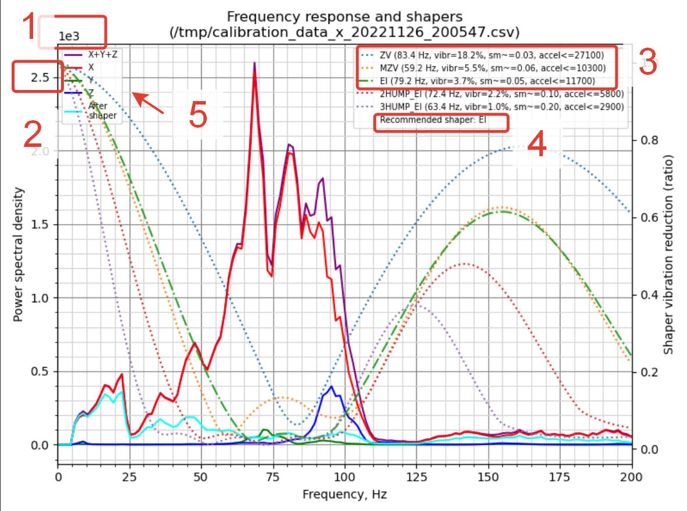
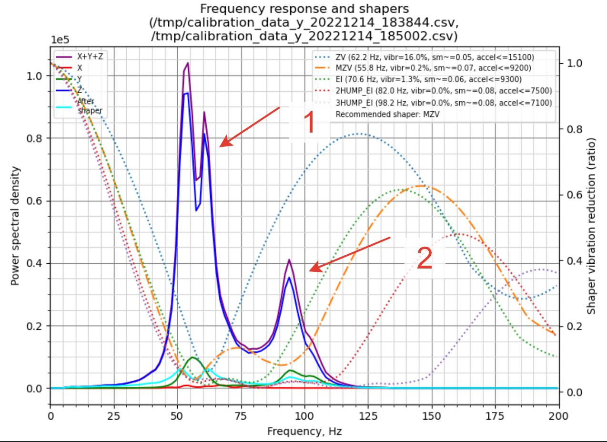
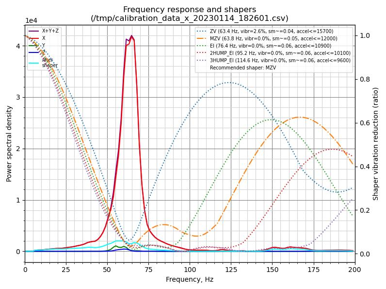
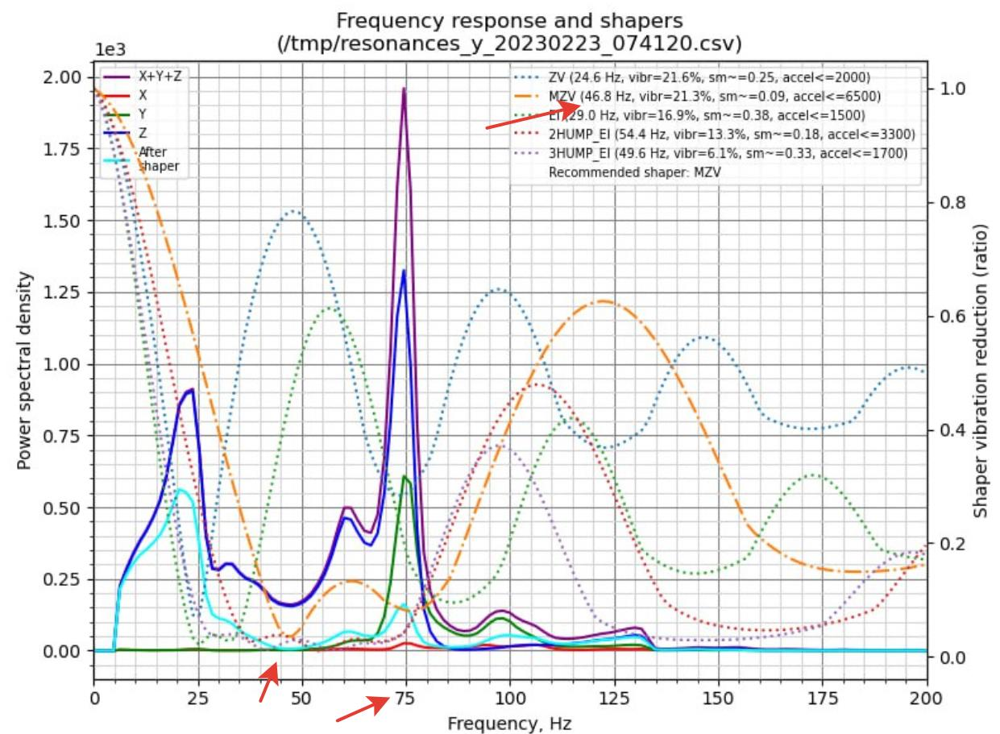

**Как перестать беспокоится и научится читать графики акслерометра**

*Сначала предлагаю посмотреть видео Дмитрия Соркина ["что не так с инпут шейпингом"](https://youtu.be/ZFPkfZEB-XU)*

после того как вы получили график теста по осям нужно понять есть ли у вас проблемы, какие они и можно применять шейперы которые вам порекомендовал автокалибровщик.

1. размерность. грубо говоря в какой степени количество ноликов в наших вершинках. тоесть если написано 1е3 это 1000 если 1е5 это 100000 
2. высота вершинок множим на размерность.. 
3. предлагаемые шейперы автокалибровщиком. имя шейпера, частота шейпера. процент остаточных вибраций после его применения.  Сглаживающее время. и ускорение. 
4. предлагаемый шейпер автокалибровщиком.
5. цветом обозначены графики по осям, отдельного внимания заслуживает голубая линия - предполагаемый график после применения рекомендуемого шейпера.
   
Теперь подробробнее по некоторым из пунктов.  

   1. Главная ошибка которую вы можете допустить это игнорировать размерность. график может выглядет красивым и близким к идеалу только потому что настолько огромен что остальные недостатки просто тонут в его высоте. и наоборот при размерностях 1е2-1е3 небольшие шероховатости могут выглядеть  огромными проблемами. 
   2. менее важный параметр но все равно 8 больше чем 1 и это надо учитывать в сравнении если вы делает несколько замеров после исправлений. 
   3. Выбор шейпера. первое на что я обращаю внимание это процент остаточных вибраций. он должен быть близким к нулю или быть равен нулю. второе это разрыв в ускорении первого шейпера и последующих.. например первый шейпер 27100 а второй 10300 это снижение в более чем два раза, значит что проблема есть, вне зависимости что нарисовано на графике, толку не будет. при шейпере скажем 12к и на ZV 9к на MZV это вполне допустимо.  если смотреть на график из первого примера даже несмотря на то, что мы видим достаточно малую размерность, мы понимаем что нормально данный принтер работать не будет. и менять частоту шейперов это как переставлять кровати в борделе, менять надо не их а работниц, а в нашем случае разбираться с кинематикой. как с этим бороться мы рассмотрим далее.

Если все не так все так и плохо после первых данных рассмотрим сам график

В данном примере мы можем предположить на основании вышесказанного что все достаточно неплохо, и предложенный шейпер будет работать вполне неплохо. Но есть несколько проблем:
1. рваный спуск у основного пика. часто говорит о том что у вас есть незакрепленные элементы  кинематики, проверьте как закрплены моторы, затянуты ли винты на подшиниках осей.
2. дополнительный пик поймать гораздо тяжелее,  да он тоже рассказывает о некой проблеме, но это уже может быть плохо стянутый корпус, неустойчивое основание, разболтанные стойки вертикальные. высокая частота около 87 герц дополнительно указывает что дребезг искать придется долго и последовательно.  внимательный читатель заметит что колебания идут по оси зет, хотя меряли вроде игрек, это ошибка составления конфига, в нескольких местах мануала это еще будет встречаться. 

Следующий пример:

В данном случае мы видим размерность 1е4 что неплохо,  0 в остаточных вибрациях рекомендуемого шейпера. сам пик один, без дополнительных зубцов на подьеме и спуске.  есть небольшой дефект на самой вершинке, но в целом если вы получили такой график. можете расслабится и смело применять автокалибровку к вашему конфигу.  

  А теперь рассмотрим пример когда автоматическая калибровка будет нести открованную чушь.

Итак смотрим размерность 1е3 - очень хорошо, смотрим ускорение первого шейпера -2000? ЧТО??  уже интересно, смотрим частоту предлагаемого шейпера 46?  несмотря на то что основной пик на 75 герцах? ну ну..  

Итак что же случилось и почему так произошло? дело в том что алгоритм вычисления шейпера плевал с высокой колокольни на размерность, и пик в районе 20 герц который на графике 1е5 мы бы даже не заметили вырос близко к основному пику, алгоритм попытался заткнуть их обоих и переместил с 75 герц основного пика колебаний на 46.8 что то между .. "И нашим и вашим и еще мы пляшем..."  да еще и максимальные ускорения опустил ниже плинтуса..  что делать в этом случае? конечно сначала поискать что там у нас так другается в районе 20 герц, учитывая размерность дергается несильно поэтому не факт, что поиски увенчаются успехом. второе это поставить шейпер вручную на основной пик и просто проигнорировать малый, решение было бы не лучшим если ваша размерность 1е4 или 1е5 но вполне допустимая если 1е2 или 1е3 в данном случае учитывая что сама высота пика 0.8. 

