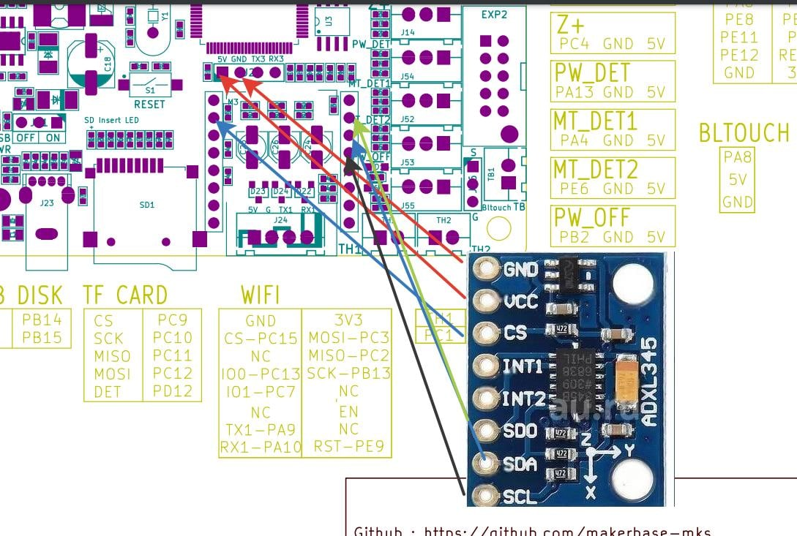

схема подключения акселерометра
в printer.cfg добавить

[adxl345]

cs_pin: PC15

axes_map: x,y,z # тут возможно придется править под ваше расположение осей

spi_software_sclk_pin: PB13

spi_software_mosi_pin: PC3

spi_software_miso_pin: PC2

[resonance_tester]

accel_chip: adxl345

probe_points:
  100, 100, 20

Проверка настройки

Теперь вы можете проверить соединение.
 введите в консоли ACCELEROMETER_QUERY
Вы должны увидеть текущие измерения акселерометра, включая ускорение свободного падения, например

Recv: // adxl345 values (x, y, z): 470.719200, 941.438400, 9728.196800

Если вы получаете сообщение об ошибке, например Invalid adxl345 id (got xx vs e5), где xx какой-то другой идентификатор, это указывает на проблему с подключением к ADXL345 или на неисправный датчик. Дважды проверьте питание, проводку (соответствие схеме, отсутствие оборванных или ослабленных проводов и т. д.) и качество пайки. 

