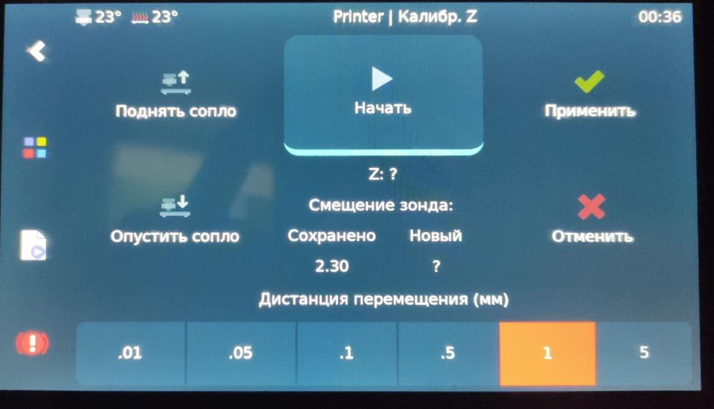
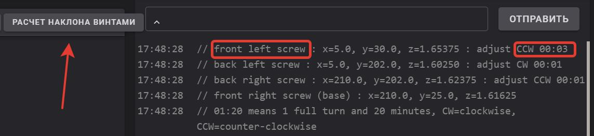

[**Вариант монтажа на стоковую голову**](https://www.thingiverse.com/thing:5660302)

[**Вариант монтажа на стоковую голову продвинутый**](https://www.thingiverse.com/thing:5744744)

Конфиг необходимо править с учетом отступов от сопла до точки замера блтач.!


**Данный конфиг верен для версии головы KARAS_4010 c экструдером BIQU H2 V2**

**Монтаж:**
Подключается в самый нижний левый на плате на нем написано bl-touch, (верхний-сигнал, средний-"+", нижний-земля) который не видно и в концевик "H"(это датчик огня не нужный). контакты концевика (средний-земля, верхний-сигнал).  


**Настройка:**
в секцию `[stepper_z]` необходимо найти исправить!(например видим `endstop_pin: !PC8` исправляем на `#endstop_pin: !PC8`) следующие строки чтобы они выглядели так:

```
#endstop_pin: !PC8 
endstop_pin: probe:z_virtual_endstop
#position_endstop: 0.5
```
(*Внимание! у вас в конфиге уже может быть раздел bed_mesh - его ищем\удаляем и потом вписываем этот*)

Создаем новый раздел и вписываем это:

```
[bltouch]

sensor_pin: ^PC4
control_pin: PA8
y_offset: -17.85
z_offset: 2.0
x_offset: 22.65
speed: 10.0
samples: 2
samples_result: median
sample_retract_dist: 3.0
samples_tolerance: 0.1
samples_tolerance_retries: 1


[safe_z_home]
home_xy_position: 105,121                                                       # CAUTION! Depends on probe X/Y offset
z_hop: 10
move_to_previous: True                                                       # Return back ~X0/Y0 after Z0 at center
z_hop_speed: 10
speed: 50
[gcode_macro G29]
gcode:
    BED_MESH_CLEAR
    G28
    BED_MESH_CALIBRATE
    BED_MESH_PROFILE SAVE=name
    SAVE_CONFIG
    BED_MESH_PROFILE LOAD=name

[bed_mesh]
speed: 40
horizontal_move_z: 5 # отступ во время проб по оси Z
mesh_min: 30,10 # CAUTION! = probe_xy = nozzle_xy + offset_xy
mesh_max: 245,185 # стол с учетом сдвига на bltouch
probe_count: 6,4 # здесь мы ставим количество точек проб по икс и по игрек
algorithm: bicubic
fade_start: 1 #на какой высоте начнем выравнивать модель
fade_end: 10 #на этой высоте в мм закончим выравнивать.

[screws_tilt_adjust] # = nozzle_xy = probe_xy - offset_xy
screw4: 5,30 
screw4_name: front left screw
screw1: 210,25
screw1_name: front right screw
screw2: 210,202 
screw2_name: back right screw
screw3: 5,202
screw3_name: back left screw
speed: 100
screw_thread: CW-M4
```
**Как настроить:**

Хоуминг в центре стола, потом двигаете туда сопло, в центр и добиваетесь зазора с которым обычно печатаете. Полученную разницу с нулём по Z вычитаете из того Z-офсет который стоял) по умолчанию ставил 2мм - норм.  И точная калибровка зазора делается при печати, просто ручками подбираее Z-офсет в клиппере и потом опять таки вычитаете из Z-офсета конфига.

**Как проверить отступ датчика от сопла:**(НЕОБЯЗАТЕЛЬНЫЙ ПУНКТ)
положите лист бумаги на стол, прижать прищепками, выровняв по краю. переместить голову над листом и карандашиком отметить где сопло, где кончик датчика. Потом снять лист, померять отступы от сопла.

Юстировка через klippersreen:



калибровка стола:


**Настройка винтов по датчику:**
01:20 означает 1 полный оборот и 20 минут по часовой стрелке СW= по часовой стрелке. CCW = против часовой стрелки. 

Очень удобная штука, винты настроить стало гораздо проще.
