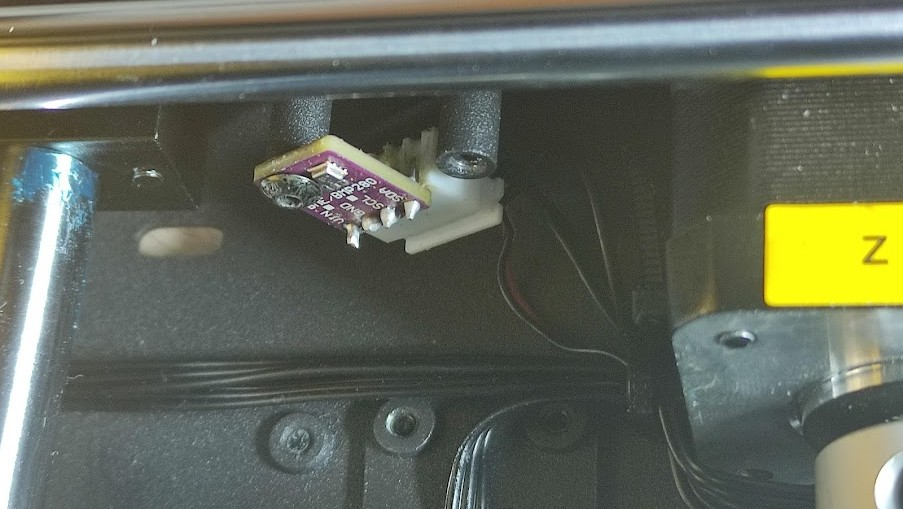

<h2>Подключение датчика температуры BME280</h2>

При одинаковом названии есть два вида датчика, на 3.3 вольта и на 5 вольт. 
3.3 имеет 6 контактов и подключается как по i2c так и по spi, а вот версия на 5 вольт только по i2c.

в принтере есть датчик огня которые обычно не подключают и на его место bme280 прекрасно подойдет если хост расположен внутри корпуса как у меня.

необходимо протянуть дополнительный провод от хоста до датчика. 

1-VCC — питание модуля 5 В;

2-GND —  Земля (Ground);

3-SCL — линия тактирования (Serial CLock);

4-SDA — линия данных (Serial Data).

на orange pi 3lts подключим их в 4 6 5 3 разъем соответсвенно

 это было самое легкое. 
 <h3>Настройка Host</h3>
 Для использования orange pi как MCU с целью получения доступа к его шинам SPI, i2c и просто к GPIO, необходимо установить и запустить исполняемый модуль Klipper и на нем.

Для этого необходимо чтобы исполняемая часть MCU на orange pi запускалась раньше, чем загрузится Klipper, для этого выполняем следующие действия:

<shell>cd ~/klipper/

sudo cp "./scripts/klipper-mcu-start.sh" /etc/init.d/klipper_mcu

sudo update-rc.d klipper_mcu default</shell>

Действиями выше, был создан новый элемент автозапуска, и добавлен в скрипты загрузки.

Далее необходимо создать прошивку для Orange PI контроллера, для этого выполняем:

<code>cd ~/klipper/

make menuconfig</code>

В меню конфигурации, следует выбрать архитектуру процессора как Linux process, нажимаем Q и сохраняем изменения.
Теперь установим исполняемую часть на Orange PI:

<code>make

sudo service klipper stop

make flash

sudo service klipper start</code>

Теперь необходимо внести изменения в printer.cfg, чтобы Klipper смог получить доступ к MCU Orange PI

<code>[mcu host]

serial: /tmp/klipper_host_mcu</code>
После выполнения этих действий и перезагрузки Orange PI вы получите доступ к шинам и GPIO вашего одноплатного компьютера.
