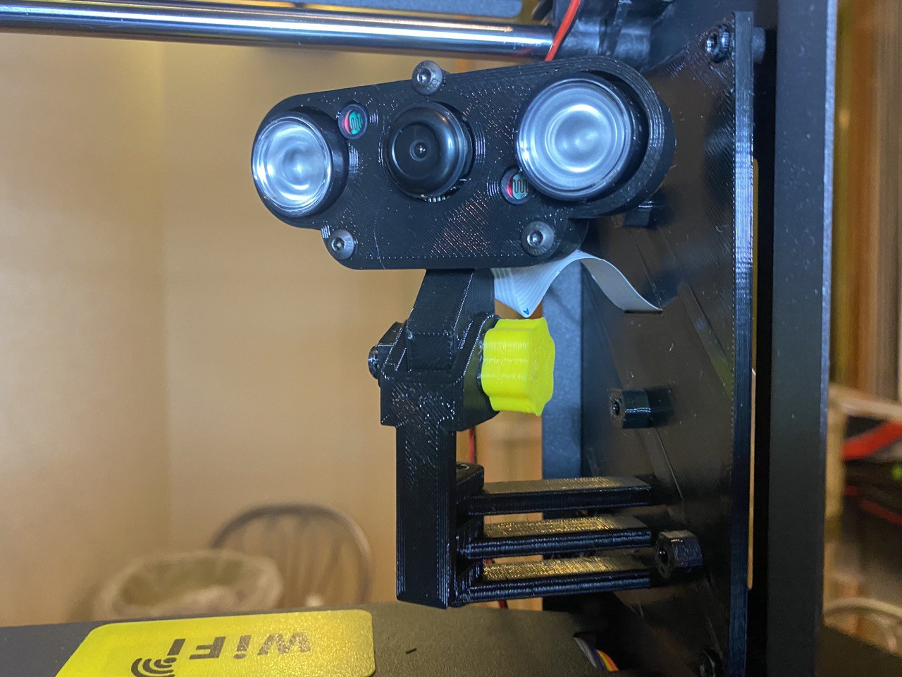
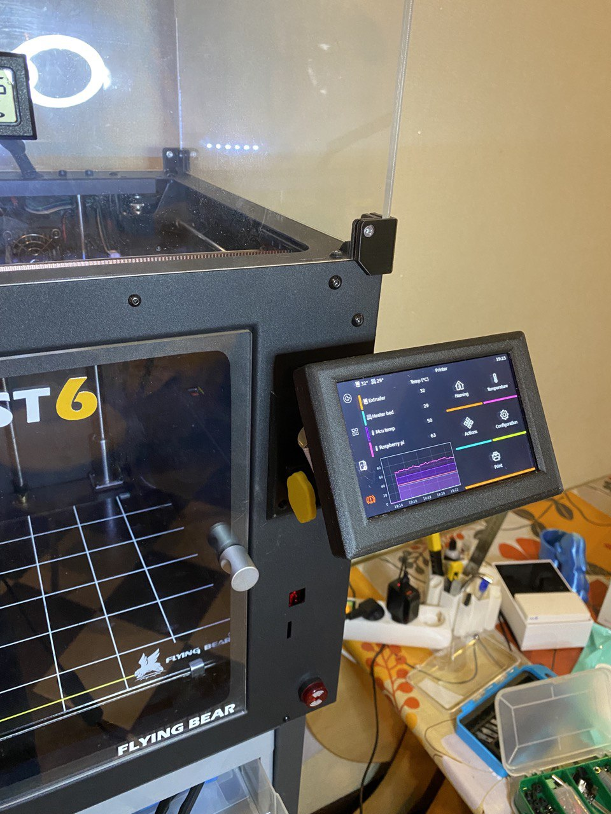

Проект «Чувырла» 

На место штатного дисплея ставится монтажная планка в которой внутри стоит камера, снаружи дисплей.

Дисплей: [BIGTREETECH PI  TFT50](https://biqu.equipment/collections/lcd/products/bigtreetech-pi-tft43-v2-0-screen-board?variant=39337700819042)

[Модуль камеры ночного видения Raspberry Pi 4B, веб-камера 5 Мп с инфракрасным датчиком светильник для Raspberry Pi 4B/3B +/3B](https://sl.aliexpress.ru/p?key=aCgJtkI)

Крепление экрана сделано на основе [проекта](https://www.thingiverse.com/thing:4689019)

ВНИМАНИЕ! В монтажные планки внутри и снаружи принтера впечатываются гайки m3 при помощи установки (нажатия) паузы на определенном слое.
[**Скачать архив**](Ghost6Cam&Display.zip)

