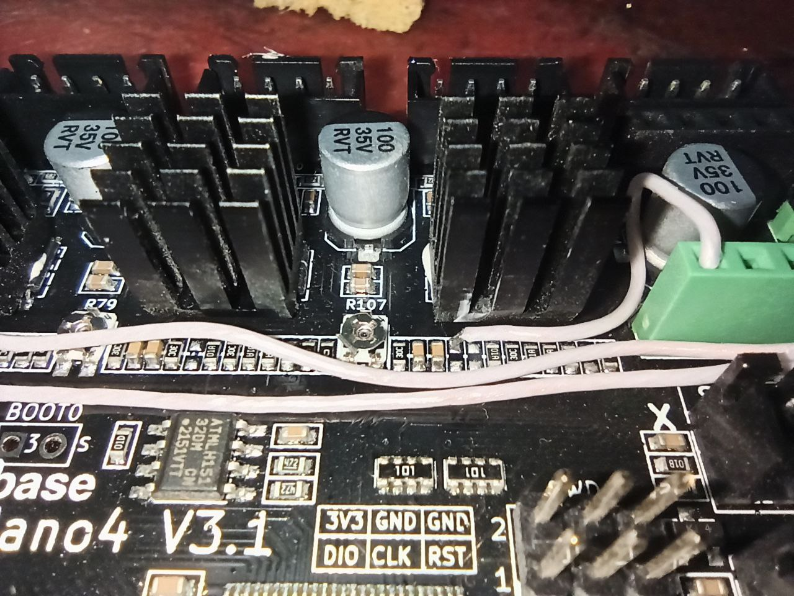
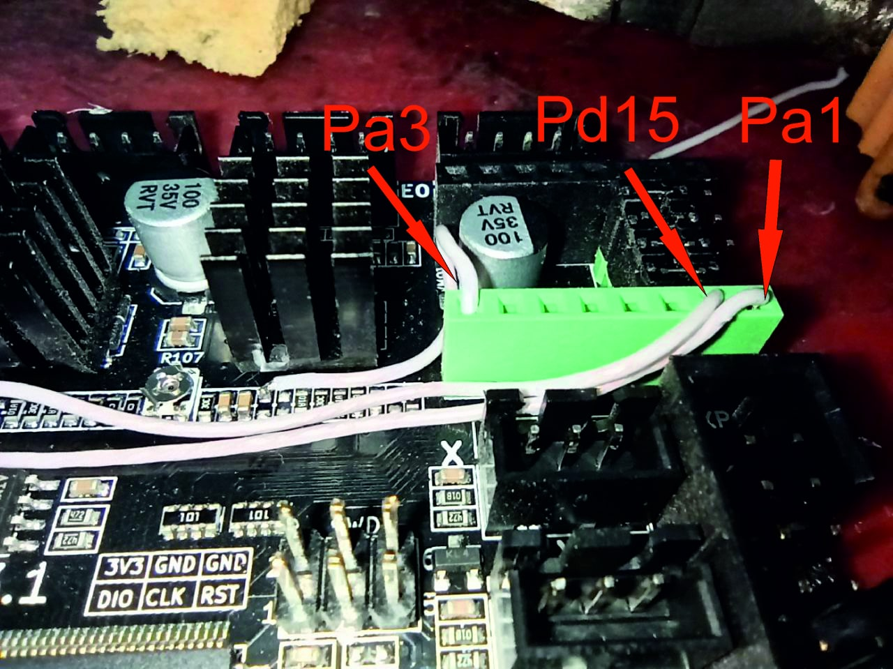

**Подключение драйверов по юарт** 


По умолчанию драйвера в тихом режиме. всем это прекрасно, кроме того что на скоростях выше 100 они начинают орать как умалишенные. Можно конечно печатать на 300 и не обращать внимания, а можно распаять по юарт и отключить этот режим.
вот пример до и после... - смотреть со звуком!

https://user-images.githubusercontent.com/59514540/202737043-5a83339d-8136-49bd-a743-e7dec3daad25.mp4


https://user-images.githubusercontent.com/59514540/202737096-bd7b8f84-f78c-458d-82d0-08003b43714e.mp4


лучше всего обратитесь к профессионалам!(я вас предупреждал)

 выпаять резисторы(устарело, можно резисторы не выпаивать) и припаять провода как указано на фото

**Ahtung! Внимание! Alarm!** после распайки залейте место спайки термоклеем, от вибрации провода могут отломать дорожку!

в `printer.cfg` добавляем строчку `[include tmc.cfg]`
копируем файл [tmc.cfg](tmc.cfg) в папку  клиппера рядом с `printer.cfg` 

необходимо исправить microstep в разделах принтера и поправить шаги экструдера.
на данный момент часть моего printer.cfg выглядит так:

```cfg
[stepper_x]
step_pin: PE3
dir_pin: !PE2
enable_pin: !PE4
microsteps: 16
rotation_distance: 40
endstop_pin: !PA15
position_endstop: 1
position_max: 255
homing_speed: 40

[stepper_y]
step_pin: PE0
dir_pin: !PB9
enable_pin: !PE1
microsteps: 16
rotation_distance: 40
endstop_pin: !PD2
position_endstop: 1
position_max: 220
homing_speed: 40


[extruder]
step_pin: PD6
dir_pin: PD3
enable_pin: !PB3
microsteps: 16
rotation_distance: 7.839
max_extrude_only_distance: 1400.0
nozzle_diameter: 0.400
filament_diameter: 1.750
heater_pin: PE5
sensor_type: Generic 3950
sensor_pin: PC1
#control: pid
#pid_Kp: 14.669
#pid_Ki: 0.572
#pid_Kd: 94.068
min_temp: 0
max_temp: 320
pressure_advance = 0.022
```
так как у меня еще подключена ось Z по UART но это в 99.9% случаях не надо, его конфиг здесь не приведен чтобы вас не путать. свой конфиг по Z оставляем как в основной части.
обратите внимание что цифры на ваших принтерах могут отличаться, коофициент pressure_advance это примерная настройка ничего не значащая для вас, настраивайте сами!





если все сделать правильно,получится как то так:


**P.S.**
После того как вы проделали все эти операции и запустили печать вы услышите странные громкие звуки при печати первых слоев на низкой скорости так обязательно услышите. Почему так происходит?

По умолчанию драйвера подключены в "тихом режиме" он же `stealthChop` именно этот "тихий режим" обеспечивал вам шум на высоких скоростях и после подключения через uart вы перешли на `spreadCycle`, быстрый(и более точный) режим который может шуметь на низких скоростях. есть настройка для каждого из моторов для включения тихого режима, и в принципе ее можно было бы включить,  документация подразумевает что на скоростях ниже определенных эти режимы будут переключаться между собой. Но, как всегда кто-то где-то что-то у нас порой...

Процитирую официальную страницу клиппера: "*Рекомендуется всегда использовать режим «spreadCycle» (не указывая stealthchop_threshold) или всегда использовать режим «stealthChop» (устанавливая stealthchop_threshold значение 999999). К сожалению, драйверы часто дают плохие и запутанные результаты, если режим изменяется, когда скорость двигателя не равна нулю.*"

Поэтому когда нибудь, мы поставим `stealthchop_threshold: 120` и на скорости ниже 120 мм\сек драйвер переключится в тихий режим, но это явно будет не сегодня и не в ближайшее время. 

Что делать? - учится печатать не на завещанных дедушками скоростях, а использовать  шейперы для компенсации резонансов и Pressure advance. Да и шум этот совсем небольшой вероятнее всего будет проявляться только на первых слоях при совсем уже черепашьих значениях.


