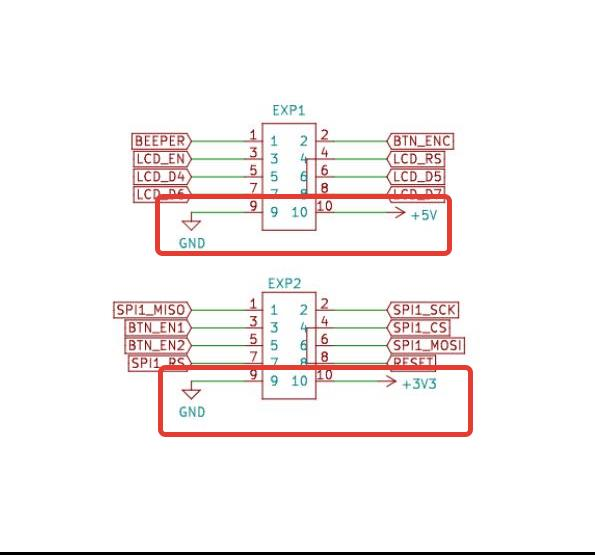
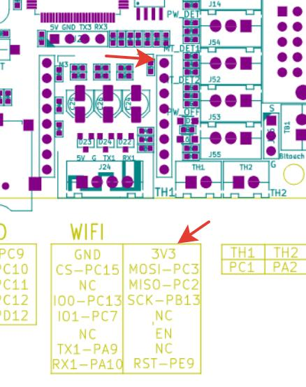
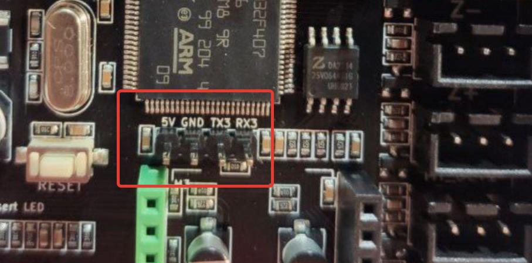
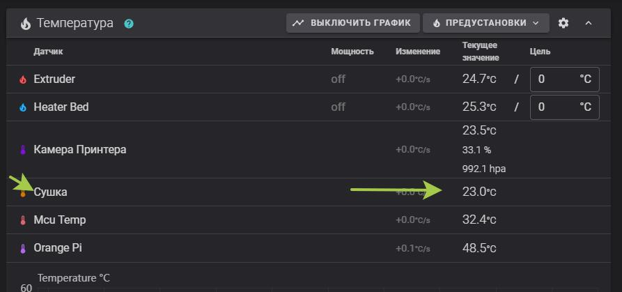

**Подключение i2c датчиков к плате принтера**

Во время печати трудно переоценить значение датчиков. Температура, влажность, все эти параметры влияют на качество печати.
я уже писал статью по применению датчика [BME280](../bme280/readme.md) но там подключение шло к микрокомпьютеру, у каждого своя операционная система, разные пины,  есть вариант изящнее и во многом проще. Для этого вам нужен только сам датчик немного проводов и небольшая добавка в `printer.cfg`.

*если на датчике написано что он может работать от 3 до 5 вольт, я советую выбрать напряжение больше для увеличения стабильности работы*

**в случае htu21d необходимо подключить к 3.3 вольта**
на рисунке колодка разьемов подключения экрана(находится в самом низу платы. EXP1 ближе к драйверам, EXP2 ближе к лицевой панели принтера)



или в разъеме wifi первый нижний пин от юарт:




Практически все датчики имеют 4 пина это VCC(3-5 вольт) GND(земля) SDA(шина данных) SCL(опорная шина) на плате принтера есть UART3 он находится рядом с разъемом WIFI. 



5V GND TX=PB10=SCL RX=PB11=SDA

Ну а теперь все просто подключаете ваш датчик согласно пинам. SDA датчика к RX, SCL датчика к TX на плате и питание, 3 или 5 вольт и земля.  

конфиги для датчиков(в любом месте вашего `printer.cfg`):

**BME280** [купить тут](https://alii.pub/6mct88)
```
[temperature_sensor Камера_принтера]
sensor_type: BME280
i2c_address: 118
i2c_bus: i2c2
```
**LM75A** [купить тут](https://alii.pub/6mct90)
```
[temperature_sensor LM75A]
sensor_type: LM75
i2c_address: 72
i2c_bus: i2c2
```

**HTU21D** [купить тут](https://alii.pub/6mctad)

```
[temperature_sensor HTU21D]
sensor_type: HTU21D
i2c_address: 64
i2c_bus: i2c2
```
После `temperature_sensor` можно вписать произвольное имя. как в первом примере.
 
 После сохранение и перезагрузки получим примерно такую картинку:

 

 для lm75 датчика температуры есть интересное применение если его разместить в камере принтера то с помощью него можно управлять кулером на корпусе. если честно этот кулер бесполезная примочка, но если вам очень хочется то добро пожаловать в референсы клиппера.  к сожалению ни htu21d ни BME280 не могут быть использованы для управления чем либо.

Также надо заметить что к одной шине SCL\SDA можно подключать несколько датчиков. На данный момент нет возможности проверить. согласно мануала подключаются они паралельно, но на всех датчиках кроме первого необходимо выпаять подтягивающие резисторы. 

P.S. Адреса i2c устройств прописываются жестко и так как у нас доступна только одна шина  если нужно 2 одинаковых датчика то необходимо искать с измененным адресом и в строке `i2c_address:`  вставить десятичный адресс, не HEX! 

