**Карась BIQU h2**

 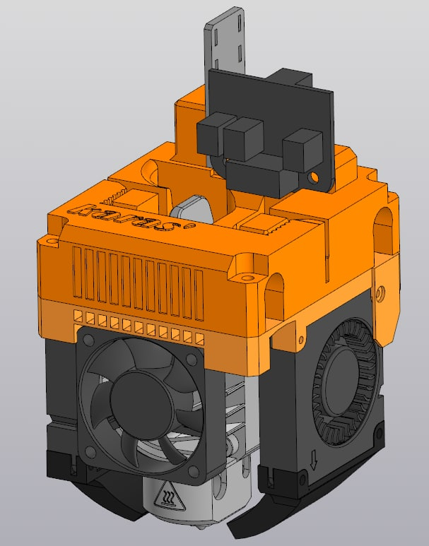

Модель головы под экструдер
Верхняя часть надевается на валы, нижняя часть фиксирует экструдер, обдув и распределение проводов.
Концептуально проектировался с целью не резать пространство для печати и с использованием стоковых комплектующих
Что понадобится, материалы
Голова печатается у меня из ПЭТЖ, сопла из АБС. Не рекомендую сопла обдува печатать из легкоплавких
Для сборки:

-4 болта м3х20

-7 болтов м3х8

-2 болта м3х6 (есть в комплекте 6-го медведя)

-7 вплавляемых гаек с косой насечкой м3 

-8 болтов для кулера м2.5х10

-[Кулера](https://alii.pub/6iebxh) (подходят сток, можно купить пошустрее, обязательно 24в)


-[Плата](https://alii.pub/6iec00) это сток, но если хотите иметь вторую...


-[Закладные гайки](https://alii.pub/6iec1k)

-[Biqu h2](https://alii.pub/6iec2j) в любом из магазинов

На верхней части должна быть отличная настройка, или низкая скорость печати (40-60) чтобы зубцы, удерживающие ремни хорошо пропечатались.

**Есть два способа снять голову
запарный 😣 и вандальный🤯**

В первом случае нужно снять две защитные заглушки, на картинке они обведены кружками, помните про стяжки и болт внутри корпуса. После снятия рекомендую засверлить заглушки на 10мм, для дальнейшей простоты обслуживания подшипников
Во втором случае нужно сделать прорези в каретке шириной 7-8мм я использовал высокоточный инструмент "кусачки"

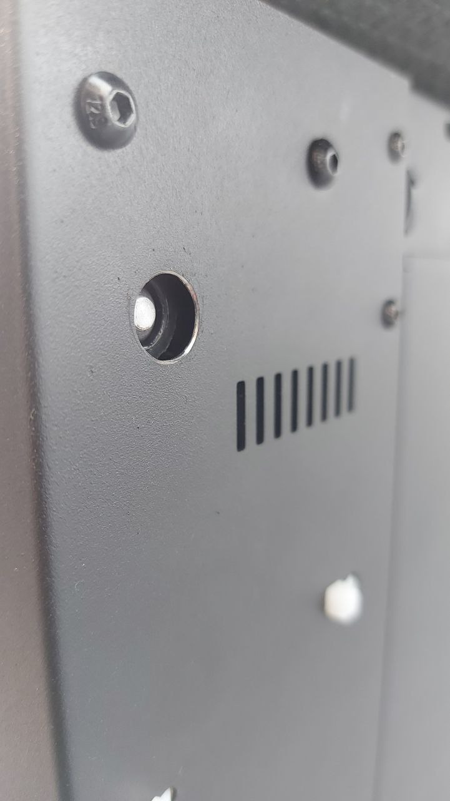
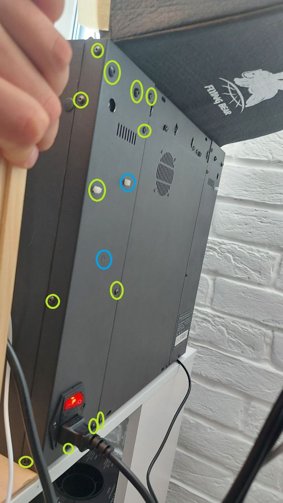
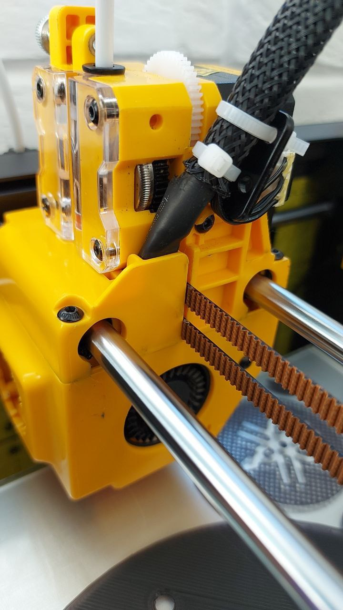

если в процессе у вас слетел ремень то вот схема протяжки ремней:
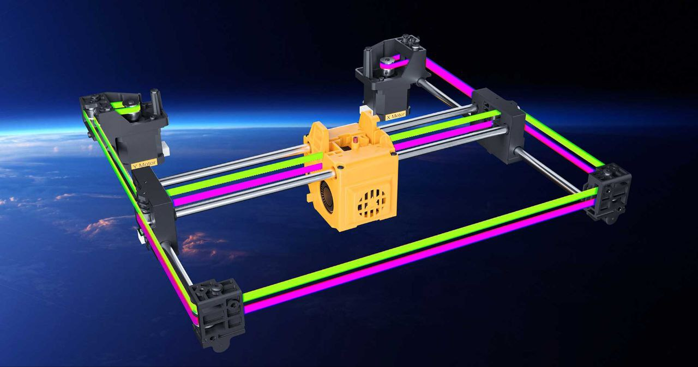

Опробовал оба, советую первый, если планируете набить подшипники смазкой

**Фазы моторов на Biqu h2**⚡️

Фазы моторов на biqu h2 не соответствуют таковым в стоке, чтобы подружить мотор и плату нужно поменять средние провода в косе, идущей на каретку.
Чтобы достать пины из разъёма не нужно тащить изо всех сил,  достаточно несильно отогнуть лапку на разъёме и потянуть провод.

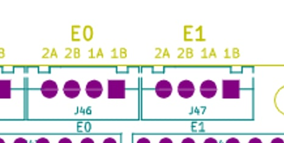
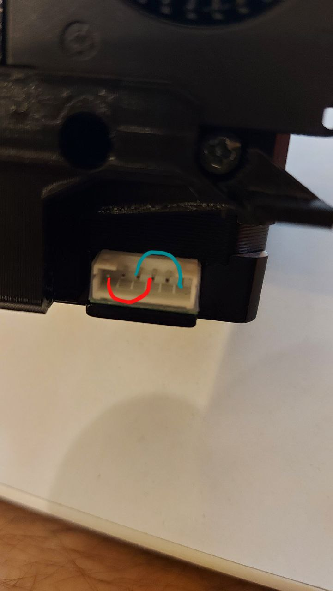
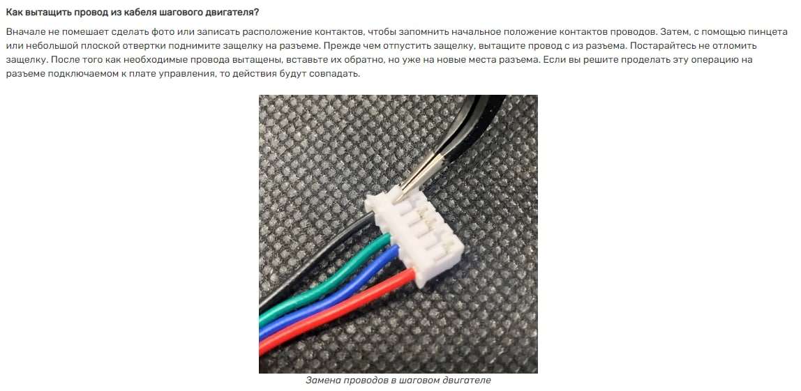

**Конечный вид, укладка проводов** ✂️

Чтобы экструдер встал в корпус правильно разъемы мотора должны смотреть влево, если у вас не так, просто раскрутите экструдер  и поверните двигатель.

В стоке к бику идут термистор и нагреватель, но Вы это самое, не пихайте матнёй всё в голову, нужно обрезать в размер!
Чтобы обжать термистер и нагреватель в плату нужно или обжать штыревым разъёмом, или залудить провода, свободной скруткой зажимать не допускается.
Касательно разводки проводов тоже всё продумано внутри корпуса, пропускайте всё через него, чтобы ничего не торчало.
Коса от платы притягивается стяжками к плавнику карася
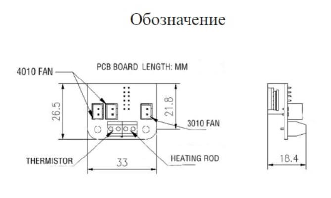

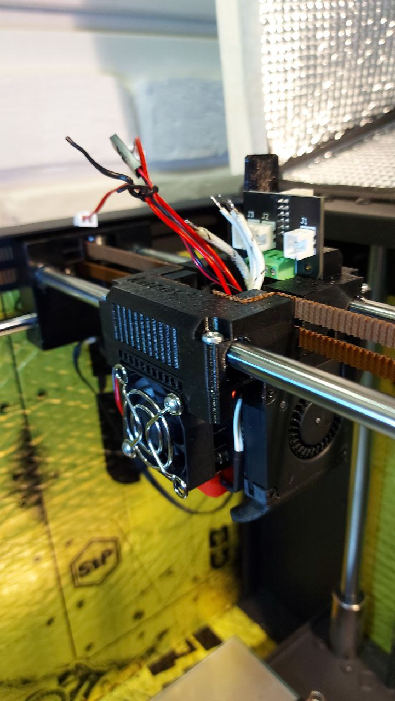
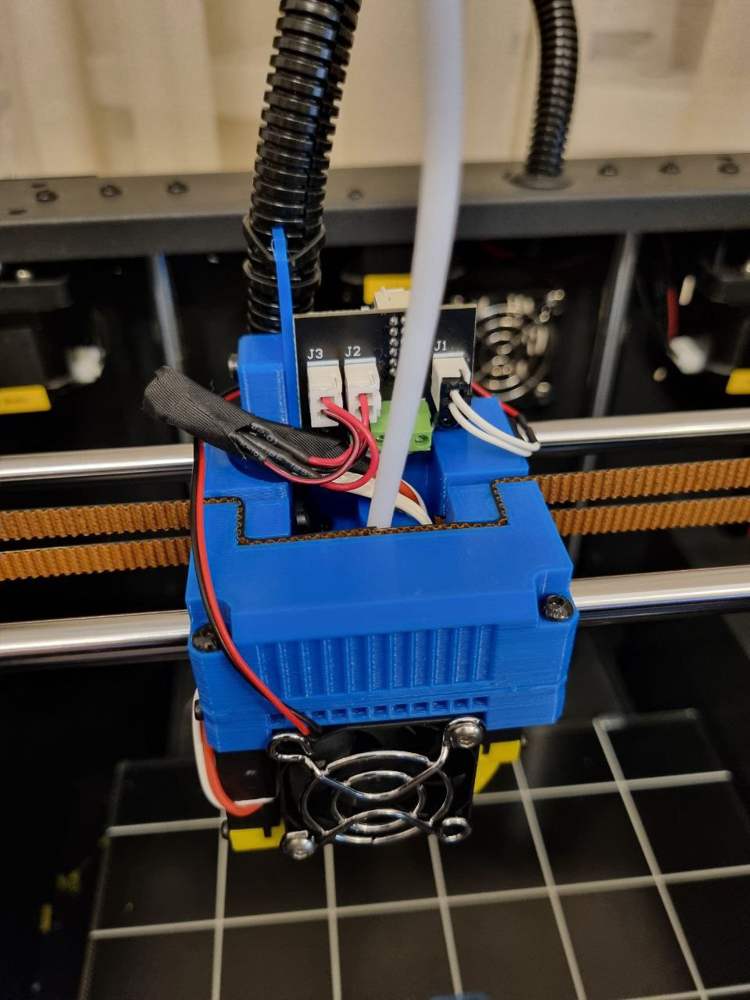
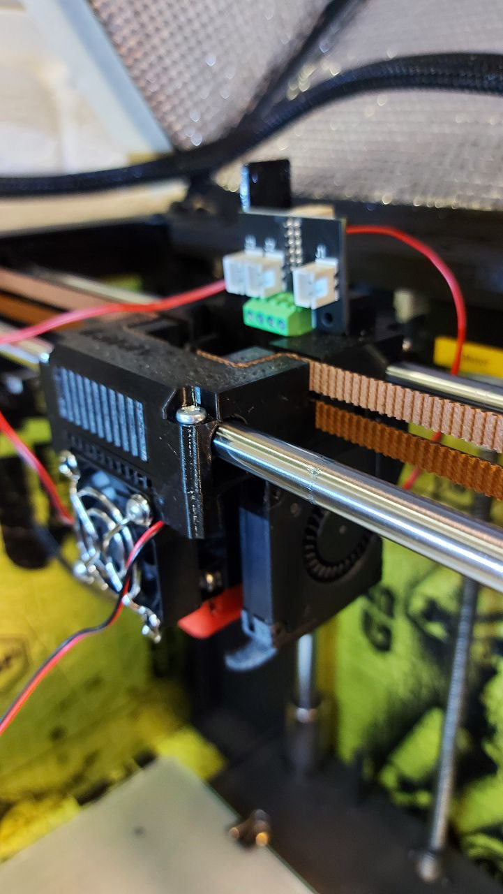


[**скачать архив**](karas.zip)           [исходники в step](Karas_stp.7z)

[есть версия с  bl-touch](Karas_niz_bltouch.stl)
[Держатель под уже напечатанную каретку](BLTouch_holder.stl)

Это оригинальный мануал от Дмитрия aka [@DmitryTis](https://t.me/DmitryTis) размещен с его разрешения. 
проект развивается и возможно еще будут улучшения, постараюсь оперативно обновлять.

P.S нашел место под акселерометр, нижние крепёжные отверстия совпали идеально.
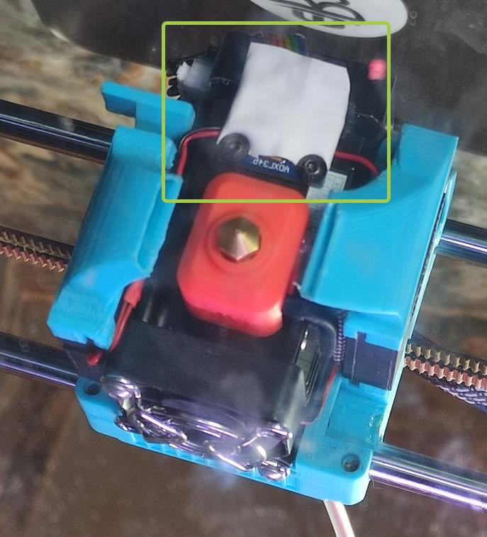

**Настройки**

после того как все подключили настала пора настроить klipper
1. В `printer.cfg` в раздел `[extruder]` добавим строку `min_extrude_temp: 0`  - это позволит выдавливать пруток без включения нагревателя. Строка временная, потом можно удалить.
2. `rotation_distance: 3.4334` это моё значение можно использовать как отправную точку для расчетов. `microsteps: 16` У меня 16  если у вас другое, не жалуйтесь что цифры не совпадают).
3. Откручиваем кулер правый, под ним у нас зажим горла. ослабляем нагреватель и термистор  и снимаем хотблок вместе с горлом.если лень или вы еще не зажимали сопло на горячую можете открутить сопло.
4. заправляем пруток, так чтобы он вышел наружу снизу и откусываем его вровень с корпусом.
5. В консоли пишем 
```
G91

G1 E300 F60
```
Это выдавит 300 мм прутка на обычной скорости экструдера.(такой расчет достаточно точный и рекомендуемый но у меня нет под руками инструмента такой величины, я решил для себя поставить 150 и мерял штангелем.)

6. *Беру свой rotation_distance = 3.4334 и делю на 300 (столько я отправил прутка на продавливание) 
получаю Х и это число умножаю на фактически вылезший пруток.* Такой нехитрой формулой получаем свой rotation_distance идеальный именно для вас. 

[**Карась Вулкан скачать**](volcano.zip)

Мои настройки печати АБС 260 30 обдув
3 стенки, 4 крышки 3 дна, 25% заполнения слой 0.2
Я печатаю соплом 0.6, но можно 0.4
Благодаря выемке под провода куллера его теберь не оттопыривает ну и на 0.8мм выдвинул правый куллер, не забудьте подобрать ширину поля, у меня на 0.5 сократилась.(c)[DmitryTis](https://t.me/DmitryTis)


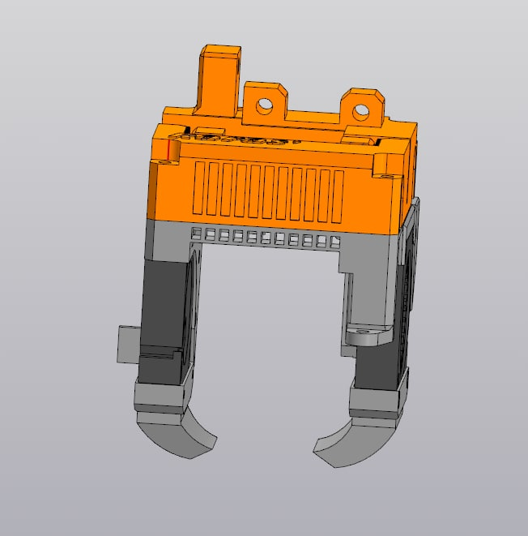

*<h2>**Карась 5015**</h2>* 7.01.2023

Версия карася под 5015 улитки. 
*в комплекте вариант под кубик в6 и вулкано. отличается соплами и креплением блтач*
[скачать модель](5015.zip) 

Внутри две версии нижней площадки под бл-тач и без него.

кулера [покупаем тут](https://alii.pub/6jb3cy)

Выбираем вот эти:
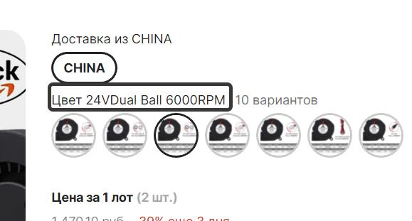

Внешний вид:

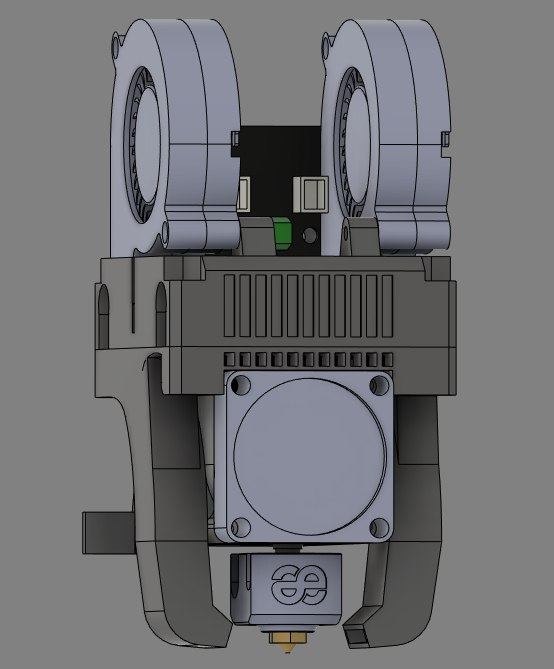
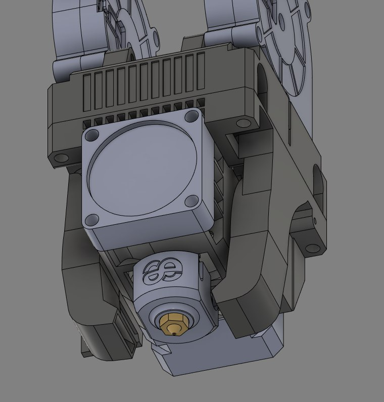

[**DEEP KARAS**](Deep__Karas.zip)

Альтернативная версия Карася. В чем отличие от оригинала:

1. Собранная конструкция на 4мм меньше по оси Z по сравнению с оригинальным карасем. В данном исполнении Карась встает в стоковые размеры. По оси Z не требуется танцев с бубном вокруг конецевика Z и область печати по Z не уменьшается.
2. Каретка связана жесткой рамкой, на которой висит экструдер. (В оригинальном Карасе эекструдер висит на монтажной планке).
3. Конструкция собирается без использрования латунных втулок. Они не нужны. Для установки можно обойтись винтами со стоковой головы. Кроме установки сопел.
   ЗЫ от автора: "В общем, кто печатает голову, ставьте скорость печати максимум 40-50. Лично у меня при такой медленной печати, все размеры совпали с КАД, хоть стреляй из них. На скоростях больше, лично у меня, размеры едут. Не сильно, но для монтажа на подшипники это критично."(с) Станислав. группа https://t.me/fbg5_waiters
   Внешний вид:
   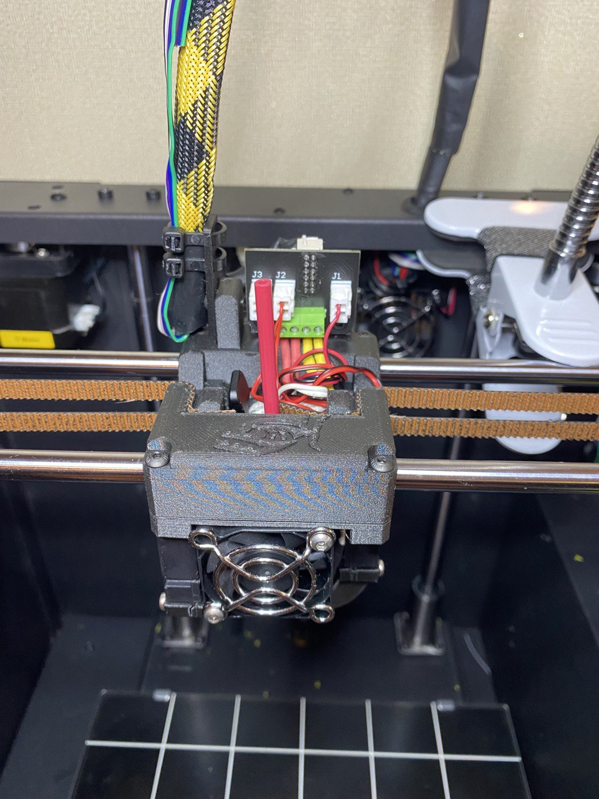
   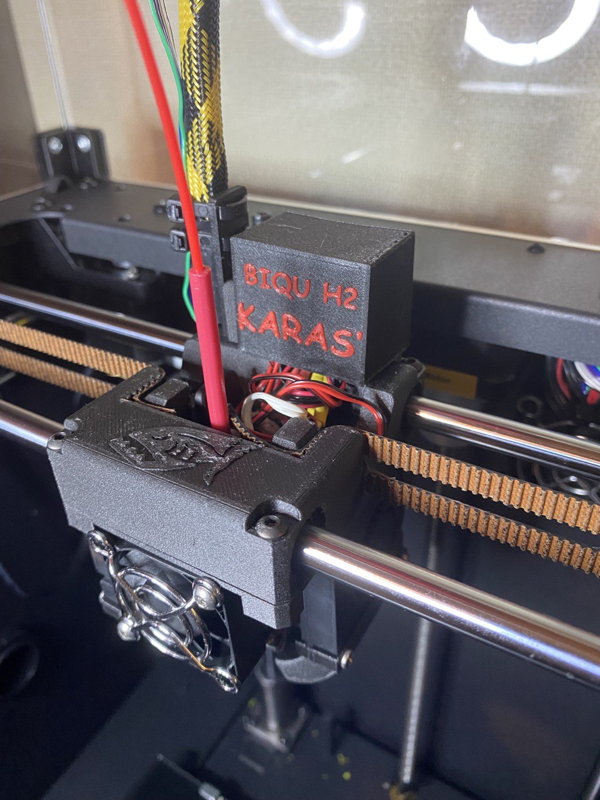

[**Deep Karas Misago7**](https://github.com/Ryoko/DeepKarasR) Глубокая переработка карася от Misago