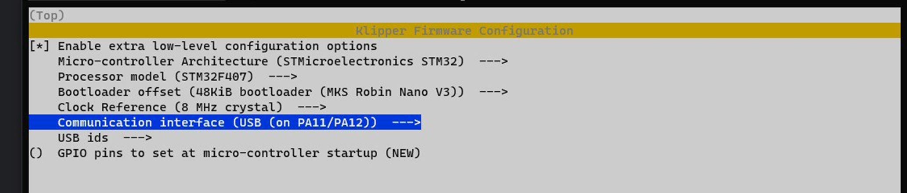
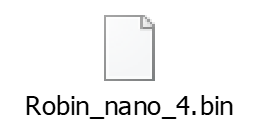

# Настройка Klipper для 3D-принтера FlyingBear Ghost 6 с подключением по USB

* одноплатник - одноплатный компьютер типа Raspbery Pi или Orange Pi (рекомендуется Orange Pi 3 LTS)


Опустим установку Klipper на одноплатник, про это есть много гайдов (например [этот](https://klipper.wiki/home/initial/base)), она не зависит от подключаемого принтера.

Итак, исходное положение, вы установили Klipper на одноплатник и рядом у вас стоит Flying Bear Ghost 6.

1. Необходимо скомплировать прошивку под ваше подключение, если вы подключаетесь по UART, то вам [сюда](mcu_uart/readme.md).
Если вы подключаетесь по USB то процесс настройки конфига прошивки и ее сборка следующие:

* в шелле пишем команду:

```make menuconfig```

запустится псевдографический менюшный интерфейс для настройки конфигурации, выглядит так:



Плата (модель процессора/Processor model) должна быть указана __407__

Bootloader (загрузчик) - __48Kb__

Интерфейс соединения - __USB__

Выбрав вышеуказанные настройки, выходим из конфигуратора, сохранившись

* далее нам надо собрать прошивку. Для этого последовательно запускаем две команды и ждем их выполнения

```make clean```

```make```

* Переходим в каталог, в который скомпилировалась прошивка ```cd ~/klipper/out``` и смотрим там листинг файлов ```ls -la```. Там должен быть файл с именем ```klipper.bin```.
Скачиваем его к себе (по scp или sftp - как это сделать, оставим вне этой инструкции) и переименовываем в ```Robin_nano_4.bin```.

Должно получиться что-то вроде этого:

[скачать](Robin_nano_4.zip) распакуйте архив!

В имени файла не надо проявлять никакой самодеятельности, указанное имя должно работать. Однако, бывали случаи, когда получалось с ```firmware.bin```. Также, в принципе, можно взять чужой файл прошивки, но необходимо быть точно уверенным, что он сделан для того же принтера, а также типа и операционной системы одноплатника. Прошивка собирается на том железе, на котором будет работать. Поэтому способ 'взять у друга' нежелательный и извинит вас только то, что у вас лапки. :o)

2. Итак, загружаем получившийся файл на флешку, выключаем принтер, вставляем в него флешку, включаем... ждем пару минут для уверенности, выключаем принтер и вынимаем (!) флешку. 

Profit! Поздравляю, у вас ~~три~~клиппер! 

Теперь осталось несколько штрихов, чтобы начать свою первую печать.

3. Настраиваем конфигурационный файл

Практически готовый конфиг можно скачать здесь -> [printer.cfg](klipper_config/printer.cfg)

Но этого мало, для того, чтобы все заработало, надо правильно указать интерфейс соединения.

* Находим файл устройства (для этого принтер уже должен быть подключен шнурком по USB и включен). 

На одноплатнике выполняем:

```ls /dev/serial/by-path/*``` (также можно использовать ```/dev/serial/by-id/```)

должны увидеть что-то типа такого:

``` /dev/serial/by-path/platform-5101400.usb-usb-0:1:1.0```

* Ищем в printer.cfg строчку [mcu]

и записываем (через веб-интерфейс клиппера, который уже должен работать или открыв файл своим любимым unix-редактором vi.. ну или nano на худой конец.. а, да, можно скачать конфиг к себе на компьютер, отредактировать и закачать обратно, но в этом случае вы рискуете его запороть виндовыми редакторами :) ) туда то, что мы увидели на предыдущем шаге:

```serial: /dev/serial/by-path/platform-5101400.usb-usb-0:1:1.0```

Сохраняемся и мы готовы. Теперь надо все перезапустить для уверенности.

Когда все загрузится, мы можем уже зайти в веб-интерфейс Klipper на нашем одноплатнике.

Если вы все сделали правильно, то внутренний объём принтера осветится неземным светом стоковой светодиодной ленты, поздравьте себя чаем с плюшкой. Но перед этим найдите раздел макросы и тыкните на PID_B, подождите около 5 минут, и потом PID_E (и тоже подождите 5 минут) для регулировки термисторов у стола и экструдера. 

Вот теперь вы справились, добро пожаловать в мир  в котором нет пределов совершенству, теперь вы не сможете остановиться в улучшении своего принтера. 


Основано на конфиге и изысканиях от [Юрия Алексеева](https://t.me/Jura_Alekseev), проверка на практике, дополнения в конфиг и авторство текста принадлежит [Tom_Tomich](https://t.me/Tom_Tomich), редактировал и верстал [Korxif](https://t.me/Korxif)

Исправления, уточнения и улучшения, а также и вопросы с радостью принимаются на [нашем телеграм-канале](https://t.me/fbg5_waiters)