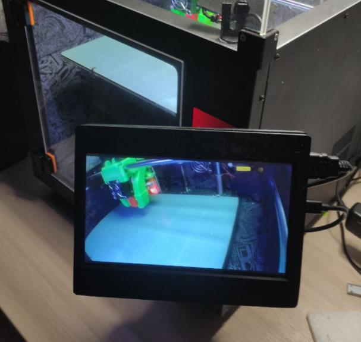
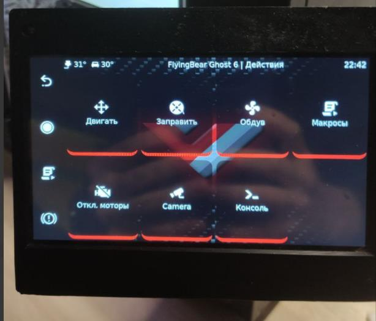
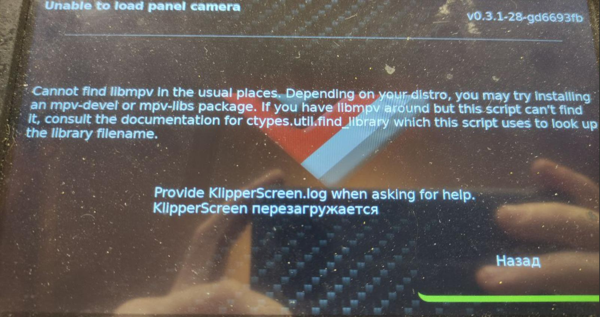

**Установка klippersreen** 

*Выжимка из чата обсуждения установки* 

На самом деле после установки через `kiah` должно само заработать сразу, решение с тачскрином ниже.

В `/etc/X11/Xwrapper.config` нужно добавить:
```bash
allowed_users=anybody
needs_root_rights=yes
```
Замена драйвера:
```bash
sudo systemctl stop KlipperScreen.service
sudo mv /etc/X11/xorg.conf.d/50-fbturbo.conf /etc/X11/xorg.conf.d/50-fbdev.conf
sudo apt-get remove xserver-xorg-video-fbturbo
sudo apt-get install xserver-xorg-video-fbdev
```
В файле `/etc/X11/xorg.conf.d/50-fbdev.conf` изменить Driver на fbdev:
```bash
Section "Device"
        Identifier      "Allwinner FBDEV"
        Driver          "fbdev"
        Option          "fbdev" "/dev/fb0"
        Option          "SwapbuffersWait" "true"
EndSection
```
Установить пакет `xserver-xorg-input-libinput`:
```bash
sudo apt install xserver-xorg-input-libinput
```
В armbian конфиге: `sudo nano /boot/armbianEnv.txt` прописать стройки касаемо HDMI:
- 5 дюймов
```bash
max_usb_current=1
hdmi_force_hotplug=1
config_hdmi_boost=7
hdmi_group=2
hdmi_mode=87
hdmi_drive=2
hdmi_cvt 800 480 60 6 0 0 0
```
- 7 дюймов:
```bash
max_usb_current=1
hdmi_force_hotplug=1
config_hdmi_boost=10
hdmi_group=2
hdmi_mode=87
hdmi_ctv 1024 600 60 6 0 0 0
```
Еще прописал в файле `/usr/share/X11/xorg.conf.d/90-monitor.conf` такое:
```bash
Section "Monitor"
    Identifier "HDMI-1"
    # This identifier would be the same as the name of the connector printed by xrandr.
    # it can be "HDMI-0" "DisplayPort-0", "DSI-0", "DVI-0", "DPI-0" etc
    Option "Rotate" "normal"
    # Valid rotation options are normal,inverted,left,right
    Option "PreferredMode" "800x480"
    # May be necesary if you are not getting your prefered resolution.
EndSection
```
Ну я бы сказал что это скорее всего является извращенной инструкцией и ставить клипперскрин лучше вручную, через это:
```bash
cd ~/
git clone https://github.com/jordanruthe/KlipperScreen.git
cd ~/KlipperScreen
./scripts/KlipperScreen-install.sh
```
Потом сюда moonraker.conf добавить это:
```gcode
[authorization]
trusted_clients:
  127.0.0.1
```
Если там уже есть адреса, то просто дописать его.


**Настраиваем тач:**

1. нашел еще руководство по экранам http://www.lcdwiki.com/7inch_HDMI_Display-C возможно после прочтения остальное будет не нужно.

2.Данная строка сразу меняет расположение и можно поиграться с матрицами перед тем как делать что то.
```bash
DISPLAY=:0 xinput set-prop "wch.cn USB2IIC_CTP_CONTROL" 'Coordinate Transformation Matrix' 1 0 0 0 1 0 0 0 1
```
если после этого начало работать
правим: `sudo nano /etc/X11/xorg.conf.d/51-touch.conf` и вписываем правильную матрицу тача.

```bash
Section "InputClass"
        Identifier "ADS7846 Touchscreen"
        MatchIsTouchscreen "on"
        MatchDevicePath "/dev/input/event*"
        Driver "libinput"
        Option "TransformationMatrix" "1 0 0 0 1 0 0 0 1"
        Option  "SwapXY"        "1"
        Option  "InvertX"       "1"
        Option  "InvertY"       "1"
EndSection
```
перегружаемся.. испытываем счастье.

**Камера а клипперскрине**

Если у вас становлена вебкамера иногда надо подкрутить фокус, направить более правильно саму камеру на стол удобно использовать клипперскрин для отображения стола



Для этого в самое начало `klipperscreen.conf`  добавляем такую строчку:

```
[printer FlyingBear Ghost 6]
# Camera configuration
camera_url: http://127.0.0.1/webcam/?action=stream
```
после перезагрузки можем увидеть такую картинку:



но при нажатии вероятнее всего увидите вот это:



для того чтобы исправить необходимо в консоли пишки(не клиппера) установить необходимый пакет:

```bash
sudo apt install libmpv-dev -y
```

после перезагрузки радуемся новому интерфейсу.

**если на клипперскрине неправильная ориентация камеры:**

к сожалению через клипперскрин конфиг поменять не получится, но есть выход отредактировать  файл webcam.txt что будет во всех смыслах более правильным решением

итак ищем строчку где наша камера например

```camera_usb_options="-r 1280x720 -f 20"```

и вписываем наш вариант поворота...  вот опции:
```
-rot: задать градус поворота (0-359, сработает коректно только 0, 90, 180  270)
-hf: горизонтальное отражение
-vf: вертикальное отражение
```
например для вертикального отражения наша строчка примет следующий вид:

```camera_usb_options="-r 1280x720 -f 20 -vf"```

P.S. у вас в опциях камеры могут свои настройки. данная строка просто пример!

не забудьте перезапустить сервис klipperscreen  для применения настроек.

**Выключаем пишку с клипперскрина**

В `klippersreen.conf`в самое начало файла добавляем:

```
[menu __main SHUTDOWN]
name: {{ gettext('Shutdown') }}
icon: complete
method: printer.gcode.script
params: {"script":"shutdown_machine"}
```
после перезагрузки в меню появится пункт "выключить" учтите, переспрашивать он не будет. так что нужно оно вам или нет думайте сами.

