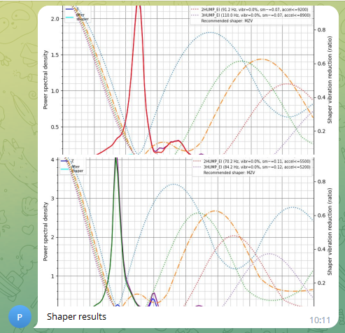

**Автоматизация теста резонансов для телеграм бота**

Если вы используете клиппер со встроенным акселерометром и когда-либо применяли тесты резонанса, вы, вероятно, хотели иметь возможность получать результаты прямо на выбранное вами устройство, а не загружать их вручную с принтера.

Благодаря возможности отправки изображений это стало реальностью, а не мечтой. Помимо клиппера и бота вам понадобится G-Code Shell Command Extension. Это позволяет выполнять команды оболочки, необходимые для выполнения соответствующего скрипта klipper python для обработки данных. Для этого необходимо запустить в консоли:

```
~/kiauh/kiauh.sh
```
выбираем 4 пункт "advanced" и там ищем "[G-Code Shell Command]" устанавливаем соглашаясь на всё) пишем "Y", выходим.

В папке с конфигами создаем файл `shaper_calibrate.sh` удобнее создать через Fluidd но это уж кому как). в него копируем следующий код:

```
#! /bin/bash
OUTPUT_FOLDER=config/adxl_results/inputshaper
PRINTER_DATA=home/pi/printer_data
KLIPPER_SCRIPTS_LOCATION=~/klipper/scripts
RESONANCE_CSV_LOCATION=tmp
if [ ! -d  /$PRINTER_DATA/$OUTPUT_FOLDER/ ] #Check if we have an output folder
then
    mkdir /$PRINTER_DATA/$OUTPUT_FOLDER/
fi

cd /$RESONANCE_CSV_LOCATION/

shopt -s nullglob
set -- resonances*.csv

if [ "$#" -gt 0 ]
then
    for each_file in resonances*.csv
    do
        $KLIPPER_SCRIPTS_LOCATION/calibrate_shaper.py $each_file -o /$PRINTER_DATA/$OUTPUT_FOLDER/${each_file:0:12}.png # check
        rm /$RESONANCE_CSV_LOCATION/$each_file
    done
else
    echo "Something went wrong, no csv found to process"
fi
```
Не забываем исправить пользователя в строчке `PRINTER_DATA=home/pi/printer_data` если вас другое имя пользователя. 

Иногда бывает проблема при копировании в windows и скрипт будет давать ошибки при попытке исполнения. тогда можно скачать его напрямую с гита к себе с помощью команды из консоли:

```
wget -P ~/printer_data/config/ https://github.com/Tombraider2006/klipperFB6/blob/main/macros/shaper_calibrate.sh
```
Потом все равно не забудьте посмотреть и подправить путь до папки если пользователь не `pi`

через консоль сделаем файл исполняемым:

```
cd ~/printer_data/config/
chmod +x ./shaper_calibrate.sh
```

В `printer.cfg` добавим следущий блок:

```
[gcode_macro telegram_shaper]
gcode:
	 #Parse parameters
	
	
	

	 #home if not homed
		G28
	
	TEST_RESONANCES AXIS=X HZ_PER_SEC={ HZ_PER_SEC } POINT={ POSITION_X },{ POSITION_Y },{POSITION_Z}
	TEST_RESONANCES AXIS=Y HZ_PER_SEC={ HZ_PER_SEC } POINT={ POSITION_X },{ POSITION_Y },{POSITION_Z}
	RUN_SHELL_COMMAND CMD=shaper_calibrate
	RESPOND PREFIX=tg_send_image MSG="path=['/home/pi/printer_data/config/adxl_results/inputshaper/resonances_x.png', '/home/pi/printer_data/config/adxl_results/inputshaper/resonances_y.png'], message='Результат проверки шейперов' "


[gcode_shell_command shaper_calibrate]
command: bash /home/pi/printer_data/config/shaper_calibrate.sh
timeout: 600.
verbose: True
```
Обратите внимание на строчки: 

1. `RESPOND PREFIX=tg_send_image MSG="path=['/home/pi/printer_data/config/adxl_results/inputshaper/resonances_x.png', '/home/pi/printer_data/config/adxl_results/inputshaper/resonances_y.png'], message='Shaper results' "`

 и 

2. `command: bash /home/pi/printer_data/config/shaper_calibrate.sh`  
 
 если имя пользователя не `pi` меняем на своё.

Работает это следующим образом:

1. Макрос вызывается с нужными параметрами, при необходимости возвращает оси в исходное положение и приступает к стандартному тестированию шейперов по обеим осям.
   
2. Макрос вызывает выполнение сценария, который запускает программу klipper python для каждого сгенерированного файла csv. Впоследствии он удаляет файлы csv, чтобы избежать путаницы при запуске нескольких тестов один за другим. Выходные изображения помещаются в подпапку в папке журналов, чтобы вы могли легко получить к ним доступ через веб-интерфейс, если это необходимо.
   
3. Макрос завершается отправкой обоих файлов вашему телеграмм-боту. Помимо того, что бот легко доступен, теперь он может выступать в качестве вашего архива измерений разума, выполняя поиск вашего сообщения, прикрепленного к изображению.


