**Процесс прошивки в картинках**

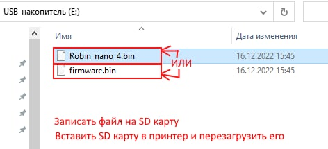

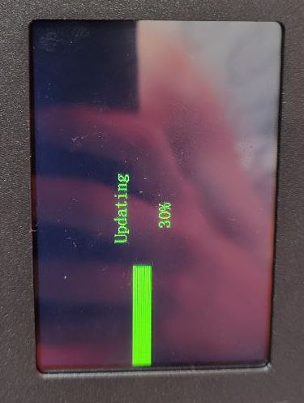

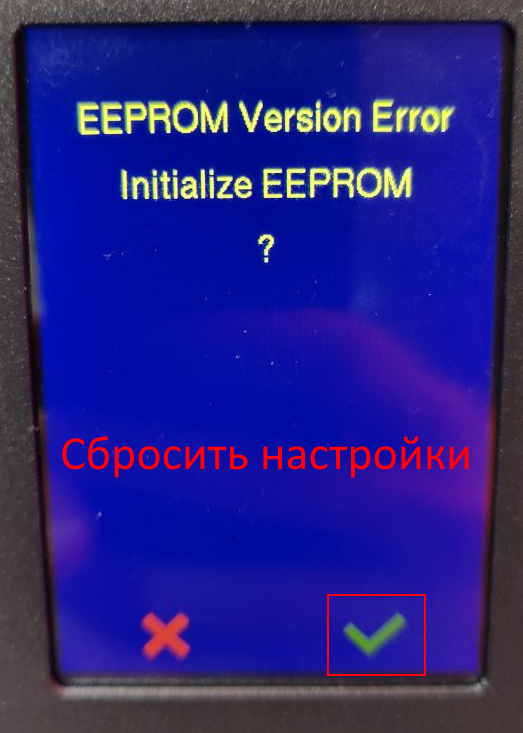

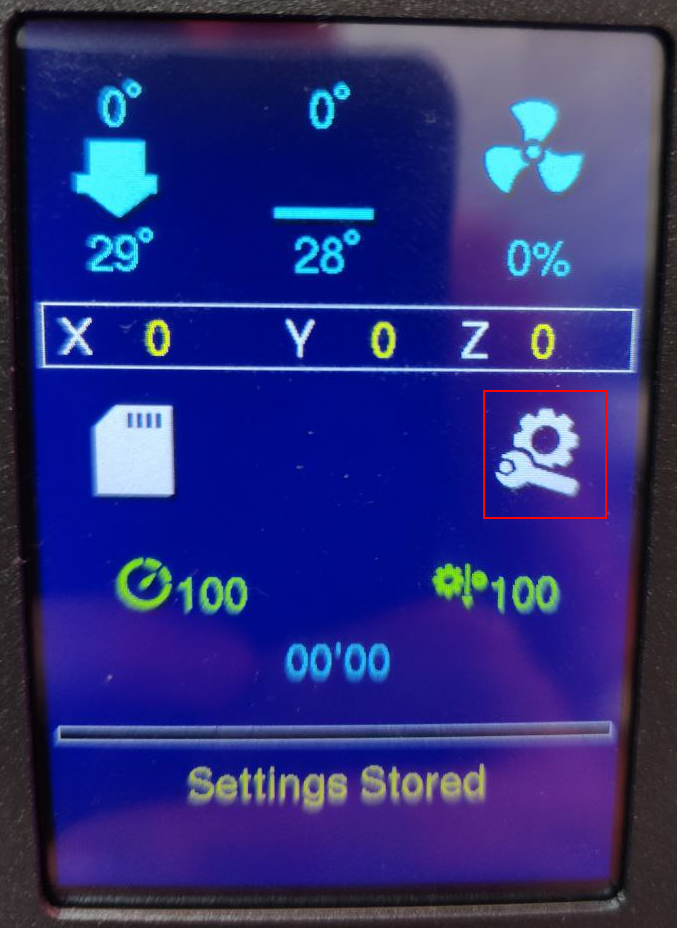

*<h2>Идем в Настройки:</h2>*

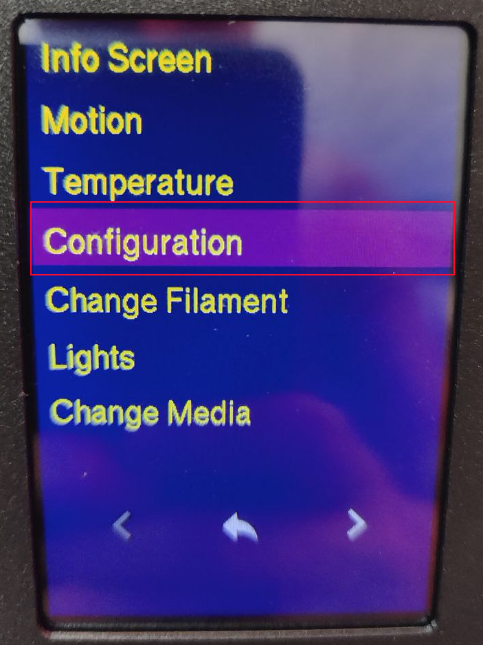

*<h2>Выбираем расширенные:</h2>*

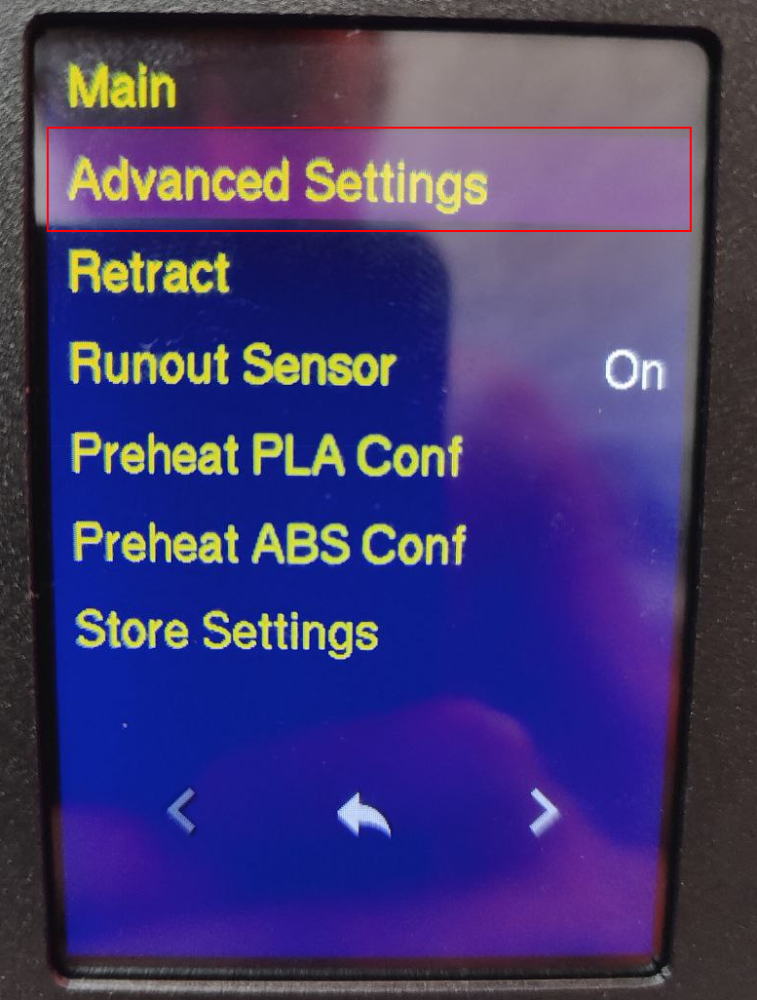

*<h2>Настройки температур 1.6:</h2>*

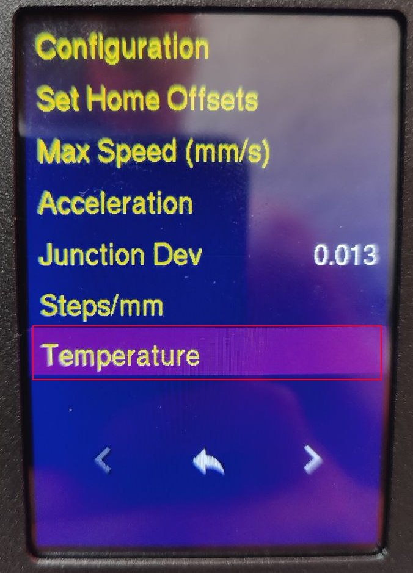

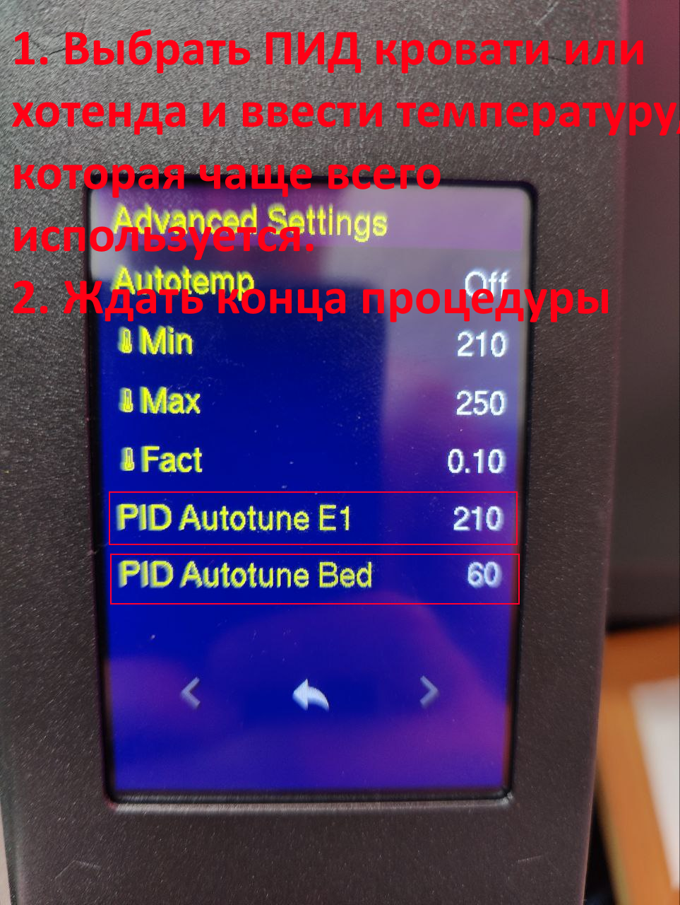

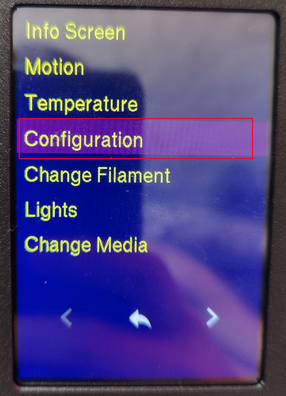

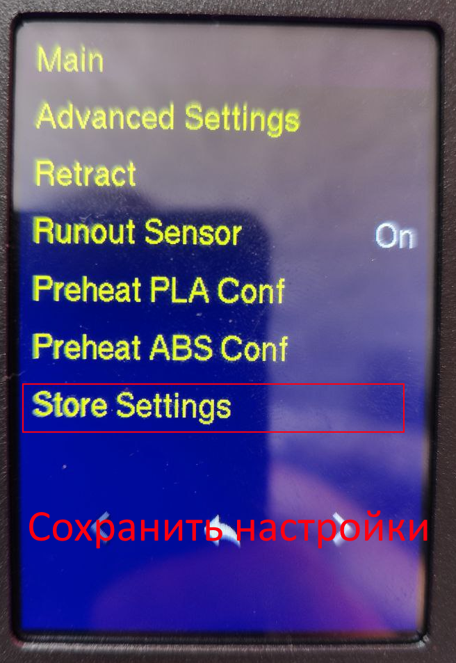

*<h2>Настройки температур 1.7:</h2>*

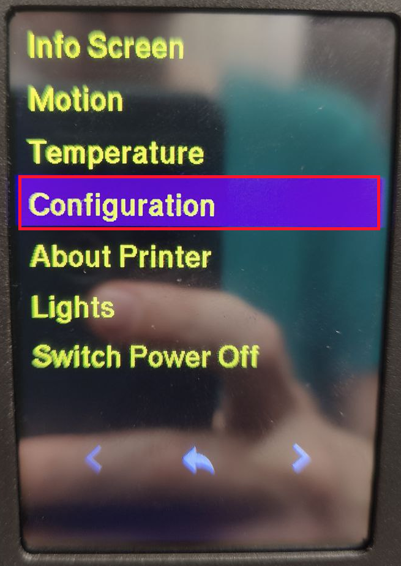

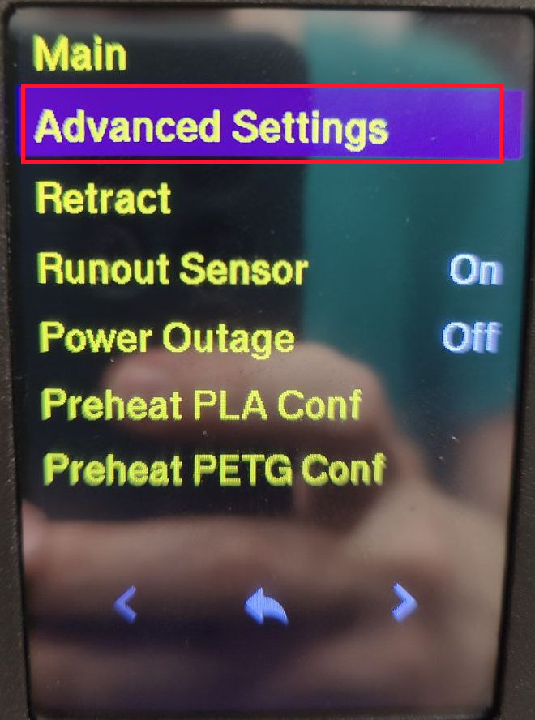

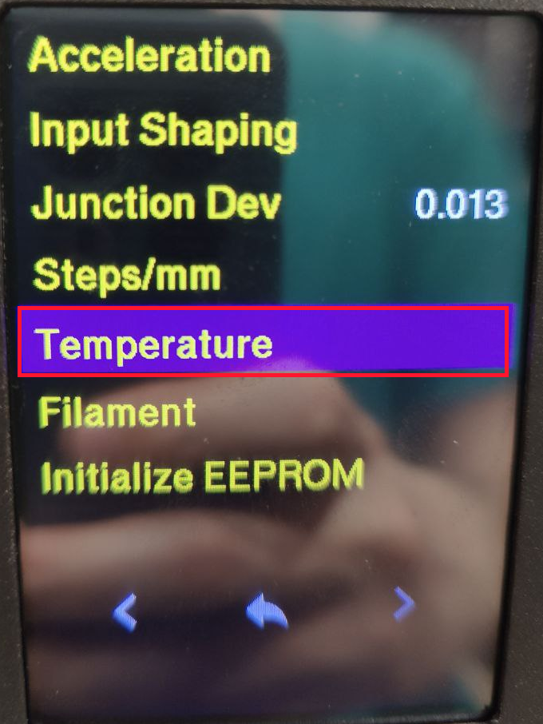

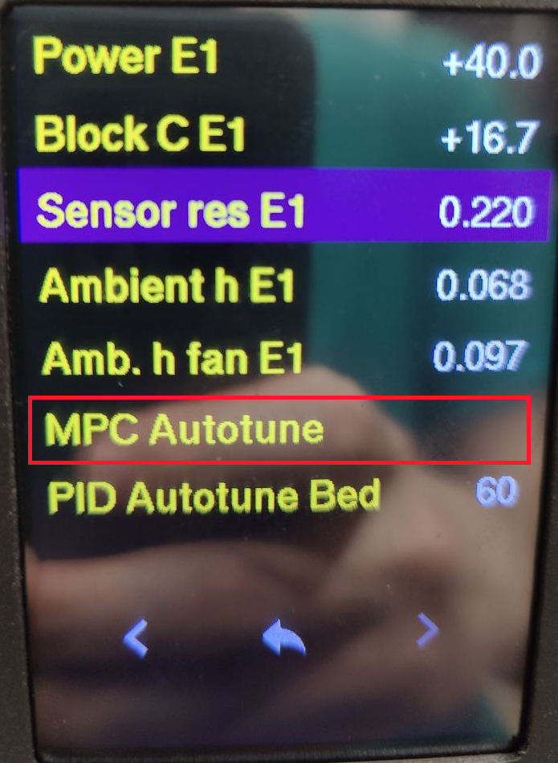