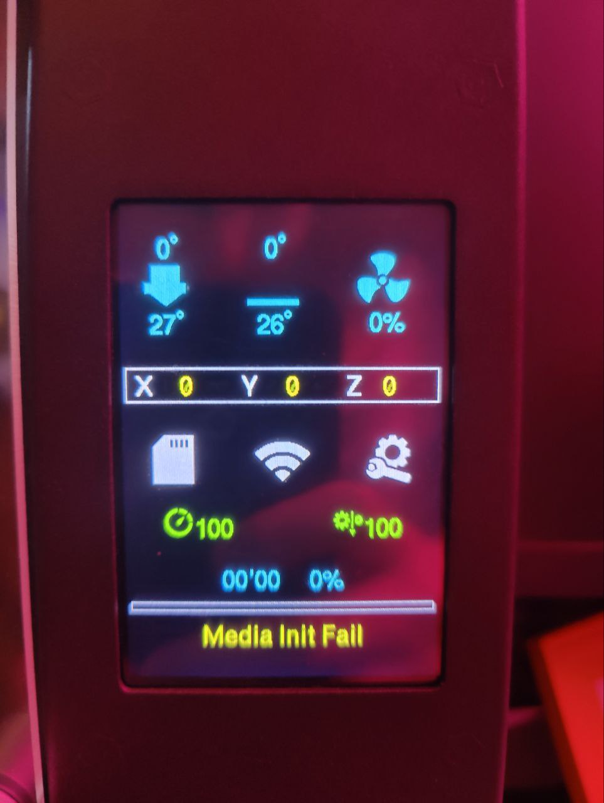
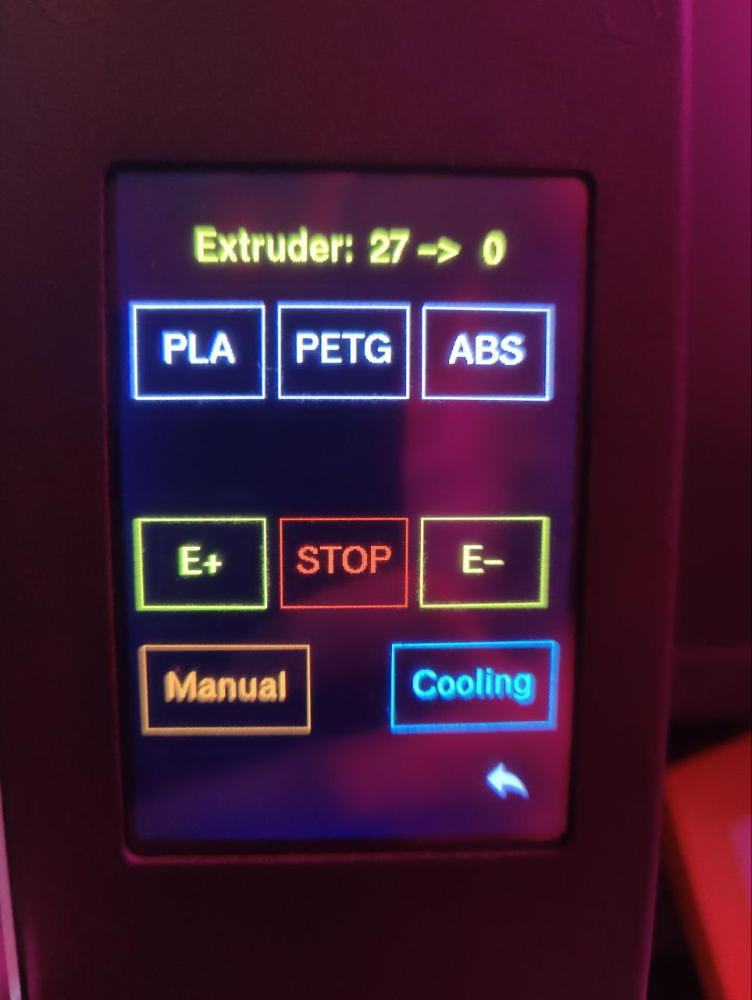
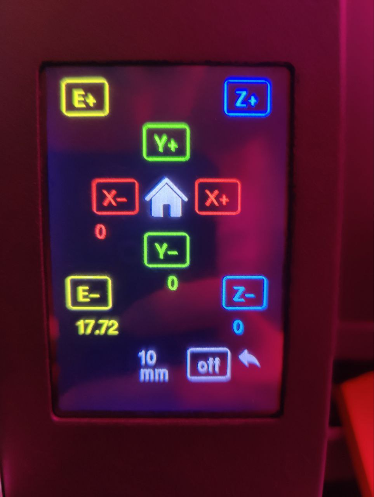
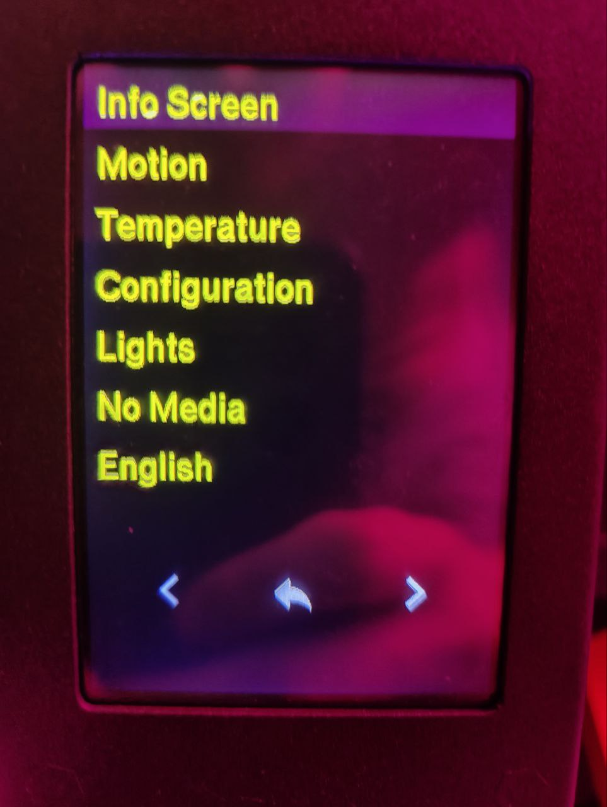

Кастомная прошивка для FBG6(интерфейс ColorUI).
Изменения в прошивке по сранению с базовым марлином:
1. Перевернут экран в вертикальный вид.
2. Поддержка WIFI и длинных имен, отправляемых по WI-FI.
3. Включен LA.
4. Добавлены экраны преднагрева для сопла и стола.
5. Включена ручная калибровка стола по 4 точкам (Bed traming).
6. Подобраны параметры ШИМ для вентиляторов обдува (снижен шум для стоковых вентиляторов).
7. Включена mesh калибровка стола, которая дает параметр Bed Z (он же Z offset).
8. Babystep сохраняется автоматически в переменную Bed Z, после каждой парковки.
9. Добавлена функция ручной замены филамента как на стоке (кнопки E+, E-, Stop). По умолчанию выдавливает 200мм прутка. Можно в любой момент остановить кнопкой Stop. 
10. Добавлена иконка Wi-Fi, показывающая ip адрес принтера и название сети, к которой он подключен. 

Прошивки 2. Под разные термисторы. с завода приезжает [104GT-2 скачать](FBG6_marlin_2.1_wifi_v1.6_104gt.rar) и [B3950 скачать](FBG6_marlin_2.1_wifi_v1.6_3950.rar) на этот термистор обычно меняют.

Над прошивкой работают @Zar_asura, @adequator, @big_vl, @DSSHack.

Что запланировано, но не реализовано или на стадии тестирования:
1. Input Shaping (ведутся тесты)
2. Отдельный экран печати (в планах)
3. Отдельный экран регулировки стола по 4 точкам (в планах)
4. Настройка Wi-Fi через принтер или файл на SD карте (в планах)

