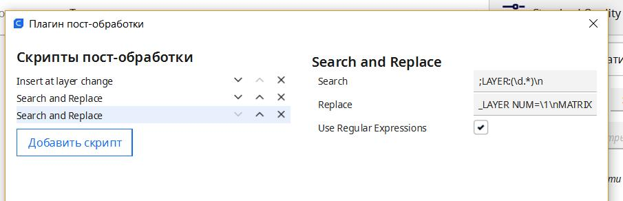

**Таймлапс в стиле фильма матрица** *в разработке*

Если вы уже прошерстили мой Гит вы наверняка уже обзавелись модулем таймлапса но есть у него один недостаток, снимает он с одного ракурса и вот данный раздел призван этот недостаток устранить. 

На данный момент  проект признан жизнеспособным, осталось только твердотельное моделирование и обкатка.

Для реализации нам понадобиться серво самая простая. sg90 подойдет.  в дальнейшем планирую использовать на 270 грудусов, сейчас пока на время разработки используется 180 градусов, подключить ее достаточно просто, у нее три вывода G - земля, VC  5 вольт, и сигнал. ничего не напоминает? да, это практически любой разъём в нашей плате) я использовал `PA8` 3d touch. 

желтый провод сигнал красный 5 вольт и черный или коричневый земля.  цепляем к принтеру. 
в printer.cfg добавляем раздел:

```
[servo matrix]
pin: PA8 #  пин на плате
maximum_servo_angle: 180 # градус сервы
minimum_pulse_width: 0.0008 # по умолчанию 0.001 тут можно поиграться когда серва не поворачивается на полную
maximum_pulse_width: 0.0025 # по умолчанию 0.002 важно не только уменьшать но и увеличивать. тоесть играем парой значений одновременно
initial_angle: 0 # не меняем. это стартовый угол при загрузке принтера
```
После того как подсоеденили и прописали можем проверить. В консоли принтера пишем: `SET_SERVO SERVO=matrix ANGLE=90` дальше пробуем максимальные углы, меняем размер импульсов. для этого можно использовать команду  `SET_SERVO SERVO=matrix WIDTH=0.001`  значения выбирайте сами,  0 выключит серву и можно подвигать руками...

Как наиграетесь можно написать макрос. у меня в `printer.cfg` есть строчка `[include macro.cfg]` и рядышком файл рядышком с таким же именем macro.cfg куда я записываю макросы чтоб они мне не мешали читать конфиг в минуты раздумий)

Итак макрос нам нужен для того чтобы посчитать общее количество слоев и номер текущего слоя  и вычислить градус на какой повернуть серву чтобы вначале был 0, а в конце 180\270 градусов соответсвенно.  спасибо неравнодушным людям которые за несколько потных дней сваяли нам вот такой макрос:

```gcode
[gcode_macro BEGIN_LAYER]
description: Start a new layer and notify system
gcode:

  
  
        
  
        
  
         { action_respond_info("COUNT of Total layers is required!") }
  

  SET_GCODE_VARIABLE MACRO=middle VARIABLE=cur_layer VALUE={CUR}
  SET_GCODE_VARIABLE MACRO=middle VARIABLE=total_layer VALUE={TOTAL}
  {action_respond_info("BEGIN CUR: %s TOTAL: %s" % (CUR, TOTAL))}


[gcode_macro middle]
description: Variable_storage
variable_cur_layer: 0
variable_total_layer: 0
gcode:
#    {action_respond_info("MIDDLE TOTAL: %s TOTAL: %s" % (CURRENT_LAYER, TOTAL_LAYER))}

[gcode_macro MATRIX]
gcode:
    
    

     #задаем переменную сдвига на слой. вот здесь и задаем свою серву 180 или 270 градусов.
 #   { action_respond_info("MATIRIX TOTAL: %s CUR: %s" % (TOTAL_LAYER, CURRENT_LAYER)) } #вывод в консоль текущего слоя и всего слоев
 #   { action_respond_info("angle %s" % angle_move) } # вывод в консоль текущего угла
    SET_SERVO SERVO=matrix ANGLE={angle_move} #4 макрос сдвига
```
Для того чтобы он заработал нам необходимо сделать так чтобы слайсер нам посылал номера слоеев и их общее количество. (*найдутся умники которые мне скажут что клиппер и так знает количество слоев но это не так, достаточно часто цифры там могут быть сильно далеки от реальных.*) 

В Cura нам надо найти раздел Расширения > Пост-обработка Изменить G-код.



Найти раздел `search and replace` и вписать в первую строчку:
`;LAYER_COUNT:(\d.*)\n` 

а во вторую: `;LAYER_COUNT:\1\nBEGIN_LAYER COUNT=\1\n`

Не забываем ставь галочку как на картинке "использовать регулярные выражения"

теперь открываем еще раз `search and replace` 

и теперь в первую строку копируем это: `;LAYER:(\d.*);\n`

во вторую это: `;LAYER:\1;\nBEGIN_LAYER NUM=\1\nMATRIX\n`

Если у вас Prusa Slicer:

в раздел **before layer change G-code** вписать:
``` 
BEGIN_LAYER NUM={layer_num} COUNT={total_layer_count};
matrix;
```
Нарезаем модель, радуемся. 
Для того чтобы всё это заработало нам нужна модель. 
А вот её как раз нет) ждемс или моделируем сами)

