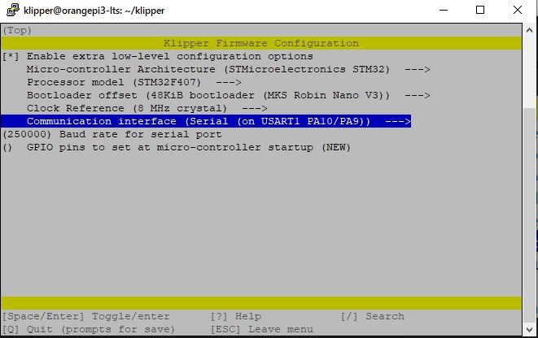

подключаем как указано на фото. в armbian config включаем uart3 
переделываем прошивку для uart подключения

в printer.cfg раскоментируем строчку подключения по uart перед строчкой подключения по serial ставим #

