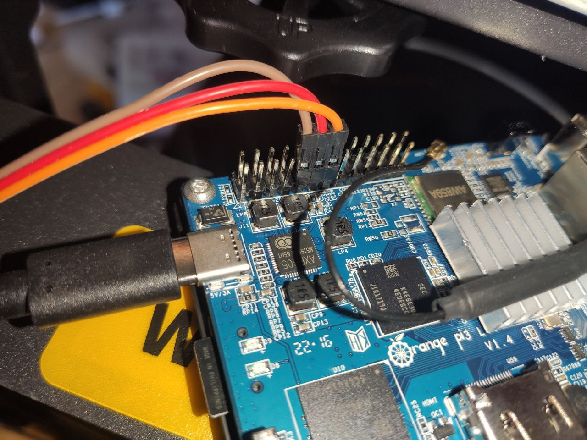

Главная путаница возникает у пользователей в наименовании номер UART, запоминаем простое правило: в printer.cfg мы указваем номер UART на одноплатнике, при компиляции прошивки в menu config мы пишем номер UART платы принтера.

подключаем как указано на фото.

```bash
sudo armbian-config
```
 раздел system подраздел hardware-  включаем uart3 


переделываем прошивку для uart подключения

```bash
cd ~/klipper
make clean
make menuconfig
```
Micro-Controller architecture - выбираем STM32

Processor model - выбираем STM32F407

Bootloader offset - 48KiB bootloader

Comunication Interface - Serial (on USART1 PA10/PA9)


Нажимаем Q, сохраняя внесенные изменения и компилируем прошивку:

```bash
make
```
прошивка скомпилировалась и находится в папке ~/klipper/out/klipper.bin 
забираем и переименовываем в Robin_nano_4.bin закидываем на карту и включаем принтер. Прошивка занимает около минуты. если прошивка удачная то на карте у вас окажется файл Robin_nano_4.cur
OrangePi 3 LTS для UART подключения использует оверлей uart3 и устройство /dev/ttyS3

В printer.cfg  ищем раздел mcu и меняем на такой вид
```bash
[mcu]
serial: /dev/ttyS3
restart_method: command
```
ниже расположены картинки как\куда именно втыкать провода.


