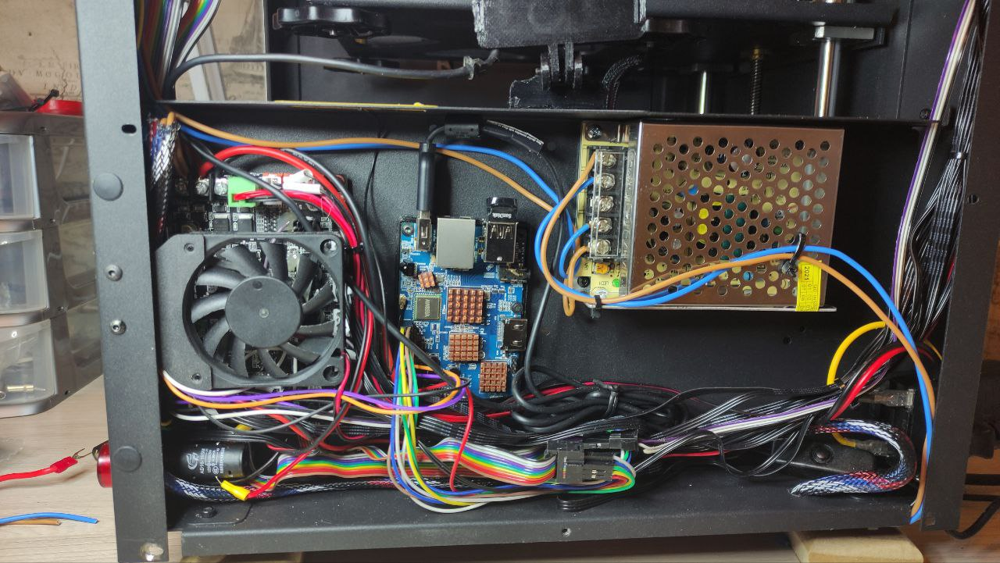

Чтобы подключить принтер к одноплатнику, чтобы ничего не торчало и выглядело хорошо я решил избавится от шумного родного блока питания и купил 
Meanwell LRS350 на 24 вольта и 350 ватт. Запас по мощности есть и главное он тоньше родного блока питания. 
далее приведу фото из которых будет почти все ясно. для питания 5 вольтовых устройств таких как лента, одноаплатник и прочее купил блок питания 5 вольт 30 ампер.

для ножек принтера использвалась [эта модель](stand.stl)

основание orange pi было закреплено через [эту модель](case-bottom.stl)

для того чтобы снизить шум от принтера решил убрать вентилятор обдува с принтера и вместо родной панели поставил [эту модель](Mean_Well_PSU_cover_-_fanless.stl) 

