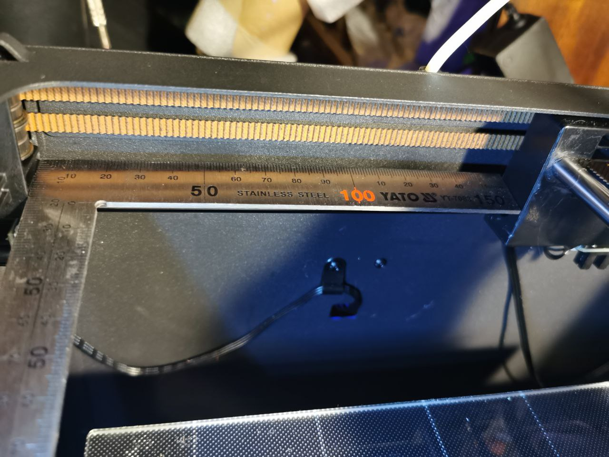

**Порядок настройки ремней**

1. Предварительно отрегулировать по ощущениям, звуку или напечатанным заранее  измерителю натяжения [модель тут](https://www.thingiverse.com/thing:2923242)
   
2. Важно что-бы ремень не был недотянут или перетянут. Движение головы при перемещении рукой должно быть достаточно плавным, без рывков. 
   
3. При равномерном натяжении обоих ремней направляющие по оси X будут перпендикулярны направляющим по оси Y. Проконтролировать это можно замерив расстояние от горизонтальны кареток до элементов крепления направляющих. Расстояние должно быть одинаковым.

4. Важно: натяжение ремней взаимозависимо. Т.е. при натяжении ремня на двигателе X, натяжение ремня на двигателе Y тоже будет увеличиваться. Важно не перетянуть ремни на этом этапе.Каждой итерацией желательно немного затягивать один из ремней и ослаблять натяжение второго. 
   
5. Важно: геометрия принтере такова, что вращение одного из двигателей X и Y обеспечивает движение печатающей головы по одной из диагоналей. По этому легкость и равномерность движения проще тестировать двигая голову по диагонали, а не вдоль осей X или Y. 
   Автор @Misago7