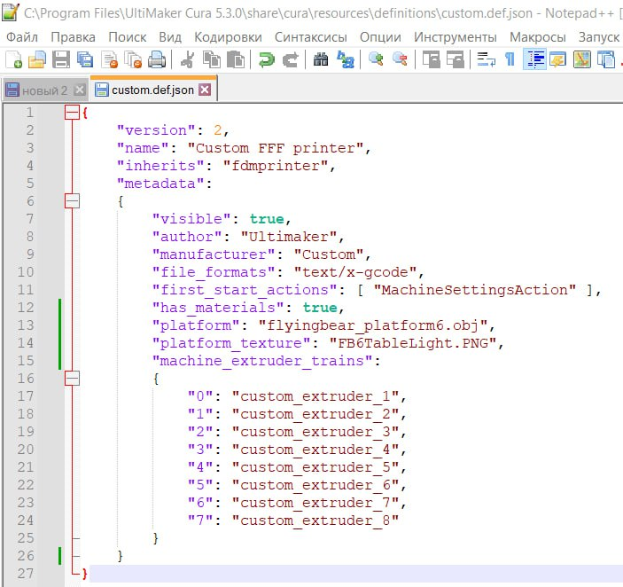

 как в куре менять картинку стола..
1) Файл png кладем в Program Files\UltiMaker Cura 5.3.0\share\cura\resources\images
2) Файл obj кладем в Program Files\UltiMaker Cura 5.3.0\share\cura\resources\meshes
3) В профиле (Профили находятся в Program Files\UltiMaker Cura 5.3.0\share\cura\resources\definitions) из которого делали принтер при первой настройке (Если "Custom FFF printer" то это файл custom.def.json) добавляем\меняем две строки

"platform": "имя файла.obj",
"platform_texture": "имя файла.PNG",

[скачать файлы](FBG6_Table.rar)

