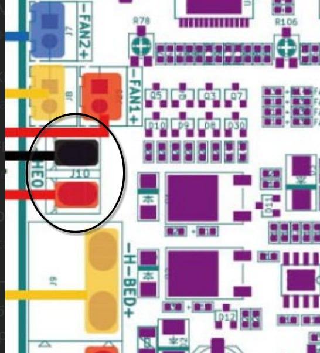

**Полезности для диагностики и ремонта платы MKS Robin Nano4**

1. Светодиод "3.3В" - наличие питания процессора. В норме светится ярко при питании платы от 12/24В БП или от USB (при установленном джампере USBPWR)

2,3. Светодиоды "Нагрев стола(2)" и "Нагрев экструдера(3). Зажигаются при активации соответствующего канала нагрева, при установившейся температуре мигают. Включены параллельно соответствующим выходным клеммам. Если светодиод горит, но нагрева нет, проблема в проводке или нагревателе.

4. Светодиоды "FAN1-FAN4". Аналогично каналам нагревателей.

5. Джампер USBPWR. Питание процессора от шины USB. При нормальной работе находится в положении OFF. Рекомендуется ставить в ON при прошивке платы вне принтера, записи bootloader, и диагностике процессора.

5-S. Светодиод "SD" справа от джамера USBPWR. Загорается при вставленной карте microSD в слот считывателя (и наличии питания 3.3В). Единственный белый светодиод на плате.

6. Джампер BOOT0. Запуск загрузчика DFU процессора STM32. В большинстве плат Nano4 с завода не распаян. Используется для загрузки mks-bootloader и прошивки в чистый (свежезапаянный) процессор, а также на последнем этапе диагностики  процессора на работоспособность. Исправный процессор при замкнутом джампере после включения или RESET должен определяться на шине USB как STM32 in DFU mode. Рекомендуется использовать с включённым USBPWR.

7. Кнопка RESET. Перезапуск процессора. Удобно применять совместно с джампером DFU или при перепрошивке процессора с карты microSD.

8. Разъём программирования SWD. Пригодится разработчикам прошивок, а также как альтернативный способ записи загрузчика mks. 

9. Переменный резистор установки тока мотора экструдера. Для стоковой головы рекомендуется выставить опорное напряжение 0.6-0.7В, что китайцы ленятся настраивать. Напряжение может быть выставлено только при подаче на плату силового питания.
Ориентировочно должен стоять в положении "01:30". С завода - в положении "12:00" (см. фото)

10. Предохранитель 30А в цепи нагревателя стола. Включён между плюсовой клеммой БП и плюсовой клеммой нагревателя.

11. Предохранитель 15А в цепи нагревателя экструдера. Включён между плюсовой клеммой БП и плюсовой клеммой нагревателя. Также через этот предохранитель запитаны вентиляторы, драйверы всех моторов И схема питания ПРОЦЕССОРА (через цепочку понижающих стабилизаторов 24В->5В->3.3В)

12. Разъём UART1. Дублирует контакты в "кроватке" от модуля WiFi. Эстеты, по разным причинам не желающие использовать перемычки DUPONT MALE-FEMALE, могут распаять самостоятельно разъём XH2.54 или PLS04.

**НАПОМИНАНИЕ!**

Тем, кто перебирает косу, меняет плату Nano4 на Nano3, ставит внешний мосфет для управления нагревом экструдера, а также занимается иными улучшениями:

Необходимо соблюдать полярность подключения проводов нагревателя - красный к плюсу разъёма на плате, чёрный к минусу! 

Звучит диковато (сам по себе нагревательный картридж неполярный), но на плюсовой шине нагревателя также сидят вентиляторы (китайцы экономные, на 2 провода в косе пожмотились)

Мне уже пару раз в личке задавали вопрос по поводу того, почему вентиляторы выключаются при включении нагрева )))

Несоблюдение полярности подключения приведёт к странностям в логике управления нагревателем и вентиляторами. Также возможно повреждение мосфетов управления вентиляторами и процессора (я ранее описывал диодную "защиту").

