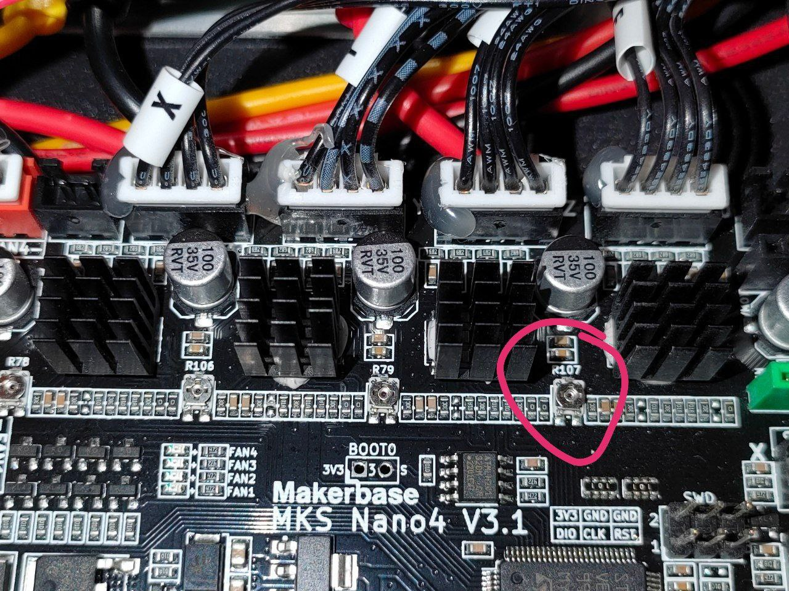
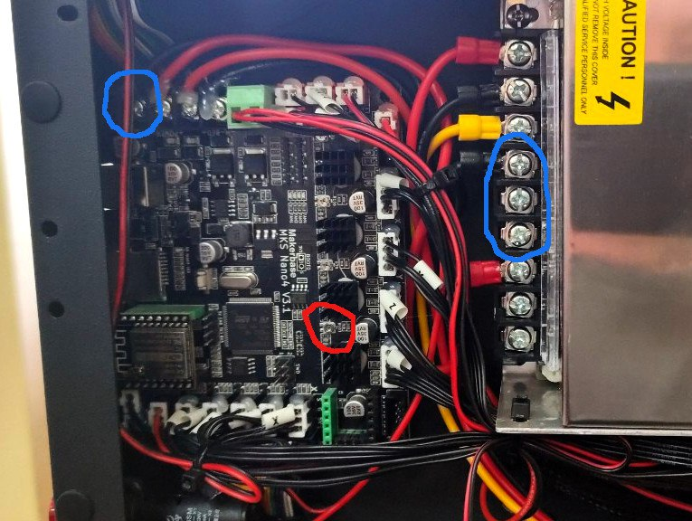

**Регулировка тока экструдера**

На многих принтерах FBG6 из обновлённой партии (где пищалка-пожарный оповещатель переехала с лицевой панели принтера в камеру печати) наблюдается повышенный ток двигателя экструдера. Это проявляется в повышенном нагреве мотора, из-за чего PLA в зубьях фидера как ириска вязнет. Также есть риск перегрева мотора и пропуска шагов.

Рекомендуется снижение опорного напряжения драйвера шагового двигателя переменным резистором R107 до величины 0.6-0.8В. 

Питание принтера  осуществляется от сети 220В, запитывать от USB недостаточно Поизучав схемотехнику стоковой платы MKS Robin Nano4, на ней опорные напряжения VREF (устанавливаемые переменными резисторами) формируется от внутреннего стабилизатора в каждом драйвере, а не от системной шины +5V (питание от шины 5В - типовое решение для сменных драйверов). 
Поскольку внутренний источник в драйвере формирует 5В из силового напряжения +24В,  для настройки VREF на стоковую плату нужно подать эти самые +24В, получаемые от силового источника питания принтера. 
**Другими словами, питания от USB недостаточно, требуется включать принтер в сеть 220В**

ВНИМАНИЕ! В процессе настройки принтер находится под сетевым напряжением 220В. Мультиметром лезть крайне аккуратно, первые 2 клеммы на блоке питания под сетевым напряжением (красный и чёрный провода, китайская схема маркировки фазы и нуля)

Для уменьшения напряжения ротор резистора крутить по часовой стрелке.  

При подстройке напряжение контролировать мультиметром.  "Минус" мультиметра подключить к минусу блока питания или платы принтера,
плюсовым щупом коснуться ротора R107 и проверить напряжение.

фото: 

см. официальное видео от медведей https://www.youtube.com/watch?v=mrw70FVJ_q0